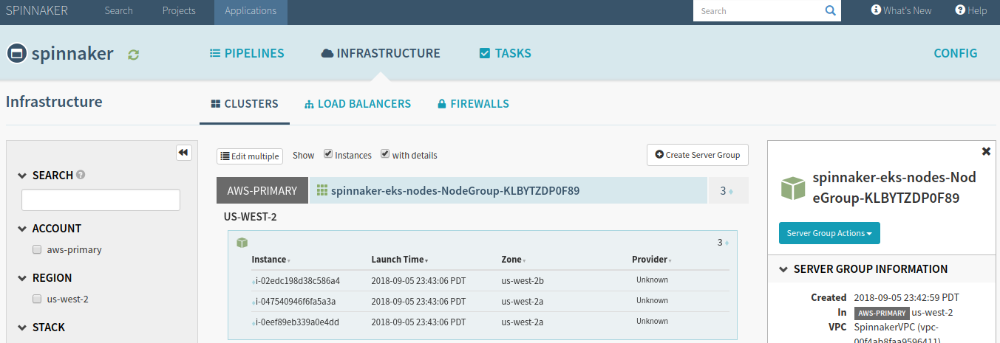
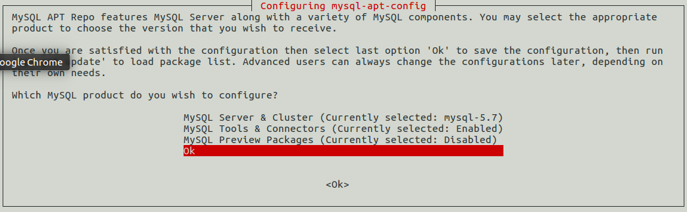
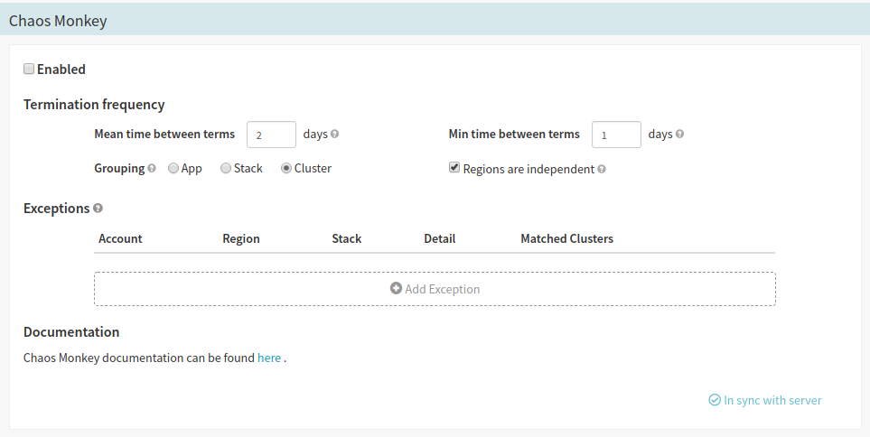

## How to Deploy Spinnaker on AWS with Kubernetes

### Install Halyard

1. Download Halyard installation script.
    - For Debian/Ubuntu: `$ curl -O https://raw.githubusercontent.com/spinnaker/halyard/master/install/debian/InstallHalyard.sh`
    - For MacOS: `$ curl -O https://raw.githubusercontent.com/spinnaker/halyard/master/install/macos/InstallHalyard.sh`
2. Install Halyard: `$ sudo bash InstallHalyard.sh`
    - If prompted, default values are typically OK.
3. Source your `.bashrc` file by inputting: `$ . ~/.bashrc`.
4. Verify Halyard was installed by checking the version.

```bash
hal -v
```

### Install AWS CLI

Install the [AWS CLI tool](https://docs.aws.amazon.com/cli/latest/userguide/installing.html) on your machine, if you haven't done so already.

> info "Simplifying AWS Credentials"
> You can make future AWS CLI commands easier by adding creating AWS `profiles`, which will add configuration and credentials to the local `~/.aws/credentials` file.  > We'll just be using a single (`default`) profile here, so we don't need to specify an actual profile name, but we could do so with the `--profile <profile-name>` flag as part of the `aws configure` command.  Check out the [official documentation](https://docs.aws.amazon.com/cli/latest/userguide/cli-chap-getting-started.html) for more info.
> ```bash
> $ aws configure
> AWS Access Key ID [None]: <AWS_ACCESS_KEY_ID>
> AWS Secret Access Key [None]: <AWS_SECRET_ACCESS_KEY>
> Default region name [None]: us-west-2
> Default output format [None]: text
> ```
> In the future, simply add the `--profile <profile-name>` flag to any AWS CLI command to force AWS CLI to use a specific profile/account.

### Setup the CloudFormation Spinnaker Stack

Now that the AWS CLI is on your machine you're ready to start the heavy lifting by deploying the EKS cluster via AWS CloudFormation.  This process takes a while for everything to propagate, so get it started while you work on the next few steps.

1. Download [this](https://d3079gxvs8ayeg.cloudfront.net/templates/managing.yaml) `managing.yaml` template.

```bash
curl -O https://d3079gxvs8ayeg.cloudfront.net/templates/managing.yaml
```

> info "Stack Configuration"
> If you need to configure the stack to your own particular needs you can easily edit the template YAML as necessary.  For example, in this guide we're only using a single **managing** account to handle Spinnaker/Kubernetes in AWS, but if you need to also include additional **managed** accounts you'll want to add their respective AWS ARN strings to the `managing.yaml` file [around this line](https://gist.github.com/GabeStah/524fdb512e65e354076d71e53d9994eb#file-managing-yaml-L158).

2. Now we'll use AWS CLI to issue a `cloudformation deploy` command to create a new `spinnaker-managing-infrastructure-setup` stack using the `managing.yaml` template.  From here on out this guide will use explicit names where applicable, but feel free to customize options as you see fit (such as the **stack name**, **EksClusterName**, and so forth).

```bash
aws cloudformation deploy --stack-name spinnaker-managing-infrastructure-setup --template-file managing.yaml --capabilities CAPABILITY_NAMED_IAM \
--parameter-overrides UseAccessKeyForAuthentication=false EksClusterName=spinnaker-cluster
```

3. This process will take 10 - 15 minutes to complete issue the following commands, which will use the AWS CLI to assign some environment variables values from the `spinnaker-managing-infrastructure-setup` stack we just created.  We'll be using these values throughout the remainder of this guide.

```bash
VPC_ID=$(aws cloudformation describe-stacks --stack-name spinnaker-managing-infrastructure-setup --query 'Stacks[0].Outputs[?OutputKey==`VpcId`].OutputValue' --output text)
CONTROL_PLANE_SG=$(aws cloudformation describe-stacks --stack-name spinnaker-managing-infrastructure-setup --query 'Stacks[0].Outputs[?OutputKey==`SecurityGroups`].OutputValue' --output text)
AUTH_ARN=$(aws cloudformation describe-stacks --stack-name spinnaker-managing-infrastructure-setup --query 'Stacks[0].Outputs[?OutputKey==`AuthArn`].OutputValue' --output text)
SUBNETS=$(aws cloudformation describe-stacks --stack-name spinnaker-managing-infrastructure-setup --query 'Stacks[0].Outputs[?OutputKey==`SubnetIds`].OutputValue' --output text)
MANAGING_ACCOUNT_ID=$(aws cloudformation describe-stacks --stack-name spinnaker-managing-infrastructure-setup --query 'Stacks[0].Outputs[?OutputKey==`ManagingAccountId`].OutputValue' --output text)
EKS_CLUSTER_ENDPOINT=$(aws cloudformation describe-stacks --stack-name spinnaker-managing-infrastructure-setup --query 'Stacks[0].Outputs[?OutputKey==`EksClusterEndpoint`].OutputValue' --output text)
EKS_CLUSTER_NAME=$(aws cloudformation describe-stacks --stack-name spinnaker-managing-infrastructure-setup --query 'Stacks[0].Outputs[?OutputKey==`EksClusterName`].OutputValue' --output text)
EKS_CLUSTER_CA_DATA=$(aws cloudformation describe-stacks --stack-name spinnaker-managing-infrastructure-setup --query 'Stacks[0].Outputs[?OutputKey==`EksClusterCA`].OutputValue' --output text)
SPINNAKER_INSTANCE_PROFILE_ARN=$(aws cloudformation describe-stacks --stack-name spinnaker-managing-infrastructure-setup --query 'Stacks[0].Outputs[?OutputKey==`SpinnakerInstanceProfileArn`].OutputValue' --output text)
```

> info ""
> You can easily output the value of an exported variable with `echo $VARIABLE_NAME`.  However, remember that unless you `export` these values they only temporarily exist in the console in which you issued the commands.  You may need to reissue the above commands later in the guide if you change terminal windows, so keep them handy.

4. Download [this](https://d3079gxvs8ayeg.cloudfront.net/templates/managed.yaml) `managed.yaml` template.  This template will create the `spinnakerManaged` **AWS::IAM::Role** that Spinnaker can use.

```bash
curl -O https://d3079gxvs8ayeg.cloudfront.net/templates/managed.yaml
```

5. Execute this secondary CloudFormation deployment using the `managed.yaml`.  Notice that this command (and many following commands) use some of the environmental variables we assigned previously, so the first stack deployment will need to be complete first.

```bash
aws cloudformation deploy --stack-name spinnaker-managed-infrastructure-setup --template-file managed.yaml --capabilities CAPABILITY_NAMED_IAM \
--parameter-overrides AuthArn=$AUTH_ARN ManagingAccountId=$MANAGING_ACCOUNT_ID
```

> info ""
> If the second step of deploying `spinnaker-managing-infrastructure-setup` hasn't completed yet, feel free to skip this step for the time being and proceed with installing `kubectl` and `AWS IAM Authenticator` below.  Just return to this step before moving past that point.

### Install Kubectl

We'll need to install the `kubectl` client and the `AWS IAM Authenticator for Kubernetes`, which will allow Amazon EKS to use IAM for authentication to our Kubernetes cluster.

1. Download the appropriate `kubectl` binary.  *Note: For the remainder of this guide we'll be using Linux examples, but most everything applies to other environments.*
  - Linux: https://amazon-eks.s3-us-west-2.amazonaws.com/1.10.3/2018-07-26/bin/linux/amd64/kubectl
  - MacOS: https://amazon-eks.s3-us-west-2.amazonaws.com/1.10.3/2018-07-26/bin/darwin/amd64/kubectl
  - Windows: https://amazon-eks.s3-us-west-2.amazonaws.com/1.10.3/2018-07-26/bin/windows/amd64/kubectl.exe

```bash
curl -O https://amazon-eks.s3-us-west-2.amazonaws.com/1.10.3/2018-07-26/bin/linux/amd64/kubectl
```

2. Change permissions of `kubectl` so it's executable.

```bash
chmod +x ./kubectl
```

3. Move `kubectl` to an appropriate `bin` directory and add to your `PATH`, if necessary.

```bash
cp ./kubectl $HOME/bin/kubectl && export PATH=$HOME/bin:$PATH
```

4. Verify that `kubectl` is installed.  The `--client` flag is used here since we're just checking for the local installation, not making any connections yet.

```bash
kubectl version --client
```

### Install AWS IAM Authenticator

We'll follow the same basic steps as above to install the AWS IAM Authenticator as well.

1. Download the appropriate `aws-iam-authenticator` binary.
  - Linux: https://amazon-eks.s3-us-west-2.amazonaws.com/1.10.3/2018-07-26/bin/linux/amd64/aws-iam-authenticator
  - MacOS: https://amazon-eks.s3-us-west-2.amazonaws.com/1.10.3/2018-07-26/bin/darwin/amd64/aws-iam-authenticator
  - Windows: https://amazon-eks.s3-us-west-2.amazonaws.com/1.10.3/2018-07-26/bin/windows/amd64/aws-iam-authenticator.exe

```bash
curl -O https://amazon-eks.s3-us-west-2.amazonaws.com/1.10.3/2018-07-26/bin/linux/amd64/aws-iam-authenticator
```

2. Make `aws-iam-authenticator` executable.

```bash
chmod +x ./aws-iam-authenticator
```

3. Move `aws-iam-authenticator` to an appropriate `bin` directory and add to your `PATH`, if necessary.

```bash
cp ./aws-iam-authenticator $HOME/bin/aws-iam-authenticator && export PATH=$HOME/bin:$PATH
```

1. Test the `aws-iam-authenticator` installation.

```bash
aws-iam-authenticator help
```

### Configure Kubectl

The [CloudFormation Spinnaker Stack](#setup-the-cloudformation-spinnaker-stack) setup step needs to be complete before proceeding.  With everything setup you can now edit the `kubectl` configuration files, which will inform `kubectl` how to connect to your Kubernetes/EKS cluster.

1. Copy and paste the following into the `~/.kube/config` file.

```yaml
apiVersion: v1
clusters:
- cluster:
    server: <endpoint-url>
    certificate-authority-data: <base64-encoded-ca-cert>
  name: kubernetes
contexts:
- context:
    cluster: kubernetes
    user: aws
  name: aws
current-context: aws
kind: Config
preferences: {}
users:
- name: aws
  user:
    exec:
      apiVersion: client.authentication.k8s.io/v1alpha1
      command: aws-iam-authenticator
      args:
        - "token"
        - "-i"
        - "<cluster-name>"
        # - "-r"
        # - "<role-arn>"
      # env:
        # - name: AWS_PROFILE
        #   value: "<aws-profile>"
```

> info "Configuring Multiple Kubernetes Clusters"
> This guide assumes you're just configuring `kubectl` to handle a single Kubernetes cluster, but if you need to configure and handle multiple clusters the convention for doing so is to create a unique `config` file for each cluster.  Simply name each `config` file `~/.kube/config-<cluster-name>`, where `<cluster-name>` is replaced by the name of the Kubernetes cluster you already created.

2. Replace the `<...>` placeholder strings with the following `EKS_CLUSTER_` environmental variable values from earlier:
  - `<endpoint-url>`: `$EKS_CLUSTER_ENDPOINT`
  - `<base64-encoded-ca-cert>`: `$EKS_CLUSTER_CA_DATA`
  - `<cluster-name>`: `$EKS_CLUSTER_NAME`

> info "Using a Specific `AWS::IAM::Role`"
> If you need to have the AWS IAM Authenticator and kubectl use a specific `Role` then uncomment the `- "-r"` and `- "<role-arn>"` lines and paste the `AWS::IAM::Role` ARN in place of `<role-arn>`.

3. Your `~/.kube/config` file should now look something like this:

```yaml
apiVersion: v1
clusters:
- cluster:
    server: https://51A93D4A4B1228D6D06BE160DA2D3A8A.yl4.us-west-2.eks.amazonaws.com
    certificate-authority-data: LS0tLS1CRUdJTiBDRVJUSUZJQ0FURS0tLS0tCk1JSUN5RENDQWJDZ0F3SUJBZ0lCQURBTkJna3Foa2lHOXcwQkFRc0ZBREFWTVJNd0VRWURWUVFERXdwcmRXSmwKY201bGRHVnpNQjRYRFRFNE1Ea3dOakExTVRnME1BHeGFNN3QyaApzcm8wa1ZOWTdCQ1g5YVBBY09rRFVuRExGektpZTJnZVZLOFpxVHJvZEpLR0p3SEtjVDJNNUtsR0ZTSjMzSGpoCk5ZeVErTnJkd0VKT2puR2xZN3R1eVFvZjhnNU0vNWZzZSt0TWFMTjJjQ3NWNFA1NCCi93UUZNQU1CQWY4d0RRWUpLb1pJaHZjTkFRRUxCUUFEZ2dFQkFKN3owTEI5NFVoZWNwTUh0VGYrVTkxVDlxU2IKNWFVRGQrdlVTNEpVTWwwdk01OXBqc05CNDU1Z1l6ZkpLelZ1YXI5TjJOVURiREllNUJsbjlCRjWb1hEVEk0TURrd016QTFNVGcwTVZvd0ZURVRNQkVHQTFVRQpBeE1LYTNWaVpYSnVaWFJsY3pDQ0FTSXdEUVlKS29aSWh2Y05BUUVCQlFBRGdnRVBBRENDQVFvQ2dnRUJBT0h6CldrZ2pzTWZ0eEJYd3NZOGRuVXI5UUQTAzUVczazlaZHZlMWNYRlp4bHdqc3RSdWN3eUxRTG12eUh0VzJsTjE4RENqSXF5OGwxeUlYSENERQpXQjI3eHo4TXg3ZDJVSjIyaThjQ0F3RUFBYU1qTUNFd0RnWURWUjBQQVFIL0JBUURBZ0trTUE4R0ExVWRFd0V5OSTJHYjV4QU1vYjJBaWQwbEQrT2NncGdDcXQvQ3h2SlFJRGpxbjRKT1AKejh6RVkvWVVsQjBUOTVXUUFsRE9ZWnlKY3lDeWxYcFZRTnNDRWNSMFhUakRaVDFVbXMyMmk4NlozYy8xQ1IrWgpKNkNqZ3IvZkNadVVaV0VUbGt1WXhlSG5CQS91ZURJM1NsMVdnY0ZFMGFyNGxsVkVFVngyS01PZXhuM09FdHI0CjhBd1dmQWxzSUNXRWdjMjRKdzk5MG9LelNObXB0cWRaOEFwczhVaHJoZWtoNEh1blpFLzhud1prb213SE1TcTYKbjl5NFJN3RyR0xWN0RzMUxWUFBlWjkKVVB0eU1WODlieFVEeFhNV3I3d2tNRy9YckdtaC9nN1gwb1grdXRnUUtiSWdPaHZMZEFKSDNZUUlyTjhHS0krcwpIMGtjTnpYMWYzSGdabUVINUIxNXhER0R2SnA5a045Q29VdjRYVE5tdlljVlNVSy9vcWdwaXd1TU9oZz0KLS0tLS1FTkQgQ0VSVElGSUNBVEUtLS0tLQo=
  name: kubernetes
contexts:
- context:
    cluster: kubernetes
    user: aws
  name: aws
current-context: aws
kind: Config
preferences: {}
users:
- name: aws
  user:
    exec:
      apiVersion: client.authentication.k8s.io/v1alpha1
      command: aws-iam-authenticator
      args:
        - "token"
        - "-i"
        - "spinnaker-cluster"
        # - "-r"
        # - "<role-arn>"
      # env:
        # - name: AWS_PROFILE
        #   value: "<aws-profile>"
```

4. Save your `config` file and export the `KUBECONFIG` variable to include the new `config` location.

```bash
export KUBECONFIG=$KUBECONFIG:~/.kube/config
```

5. Verify that `kubectl` is able to use your credentials to connect to your cluster with `kubectl get svc`:

```bash
$ kubectl get svc

NAME         TYPE        CLUSTER-IP   EXTERNAL-IP   PORT(S)   AGE
kubernetes   ClusterIP   172.25.0.1   <none>        443/TCP   31m
```

### Create AWS Accounts and Roles

We now need to apply service accounts and roles to the `kubectl` `spinnaker` namespace.  In Kubernetes, a [namespace](https://kubernetes.io/docs/concepts/overview/working-with-objects/namespaces/) is a *virtual* cluster, which can join other virtual clusters and all be housed within the same *physical* cluster.

1. Issue the following commands to create the `spinnaker` namespace, `spinnaker-service-account` service account, and `spinnaker-admin` binding.  The [`apply`](https://kubernetes.io/docs/reference/generated/kubectl/kubectl-commands#apply) command in `kubectl` applies a configuration based on the passed resource (YAML files, in this case).

```bash
CONTEXT=aws
kubectl create namespace spinnaker
kubectl apply -f https://d3079gxvs8ayeg.cloudfront.net/templates/spinnaker-service-account.yaml
kubectl apply -f https://d3079gxvs8ayeg.cloudfront.net/templates/spinnaker-cluster-role-binding.yaml
```

2. Next, we're creating the authentication `TOKEN` environmental variable.

```bash
TOKEN=$(kubectl get secret --context $CONTEXT \
   $(kubectl get serviceaccount spinnaker-service-account \
       --context $CONTEXT \
       -n spinnaker \
       -o jsonpath='{.secrets[0].name}') \
   -n spinnaker \
   -o jsonpath='{.data.token}' | base64 --decode)
```

3. Pass the `TOKEN` to the following configuration commands to set `kubectl` credentials.

```bash
kubectl config set-credentials ${CONTEXT}-token-user --token $TOKEN
kubectl config set-context $CONTEXT --user ${CONTEXT}-token-user
```

### Add Kubernetes Provider to Halyard

The next step is to add Kubernetes as a provider to Halyard/Spinnaker. A [provider](https://www.spinnaker.io/concepts/providers/) is just an interface to one of many virtual resources Spinnaker will utilize.  AWS, Azure, Docker, and many more are all considered providers, and are managed by Spinnaker via `accounts`. 

1. Start by enabling the Kubernetes provider in Halyard.

```bash
hal config provider kubernetes enable
```

2. Add the `kubernetes-master` account to Halyard.

```bash
hal config provider kubernetes account add kubernetes-master --provider-version v2 --context $(kubectl config current-context)`
```

3. Enable the `artifacts` and `chaos` features of Halyard.  [Artifacts](https://www.spinnaker.io/reference/artifacts/) in Spinnaker merely reference any external resource, such as a remote file, a binary blob, and image, and so forth.  The `chaos` feature allows us to utilize Chaos Monkey, the base form of which is built into Spinnaker by default.

```bash
hal config features edit --artifacts true
hal config features edit --chaos true
```

### Add AWS Provider to Halyard

Now we need to also add AWS as another provider and account.  Be sure to replace `<AWS_ACCOUNT_ID>` with the primary/managing account ID of your AWS account.

```bash
hal config provider aws account add aws-primary --account-id <AWS_ACCOUNT_ID> --assume-role role/spinnakerManaged
hal config provider aws enable
```

### Add ECS Provider to Halyard

The last provider to enable is ECS.  We'll add the `ecs-primary` account to Halyard and associate it with the `aws-primary` AWS account added above:

```bash
hal config provider ecs account add ecs-primary --aws-account aws-primary
hal config provider ecs enable
```

### Use Distributed Deployment

We also need to ensure Halyard deploys Spinnaker in a distributed fashion among our Kubernetes cluster.  Without this step, the default configuration is to deploy Spinnaker onto the local machine.

```bash
hal config deploy edit --type distributed --account-name kubernetes-master
```

> error "Error: `kubectl` not installed, or can't be found by Halyard."
> If you get such an error when issuing the distributed deployment command above, it likely means Halyard just needs to be restarted.  Simply issue the `hal shutdown` command to stop the Halyard daemon, then retry the deployment edit command again, which will automatically restart Halyard before executing.

### Use S3 for Persistent Storage

We also need to allow Spinnaker to use AWS S3 for storing persistent data (in this case, creating a small S3 bucket).  Issue the following command by replacing `<AWS_ACCESS_KEY_ID>` with any AWS access key that has full S3 service privileges.

```bash
hal config storage s3 edit --access-key-id <AWS_ACCESS_KEY_ID> --secret-access-key --region us-west-2
hal config storage edit --type s3
```

### Create Kubernetes Worker Nodes

Now we'll launch some AWS EC2 instances which will be our worker nodes for our Kubernetes cluster to manage.

1. Download [this](https://d3079gxvs8ayeg.cloudfront.net/templates/amazon-eks-nodegroup.yaml) `amazon-eks-nodegroup.yml` template file.

```bash
curl -O https://d3079gxvs8ayeg.cloudfront.net/templates/amazon-eks-nodegroup.yaml
```

> info "Adjust Worker Nodes"
> The default template creates an auto-balancing collection of up to **3** worker nodes (instances).  Additionally, the deployment command we'll be using below specifies `t2.large` instance types.  As always, feel free to modify the `amazon-eks-nodegroup.yaml` or instance types to meet your needs.

2. Issue the following command to use the template and create your worker node collection.

```bash
aws cloudformation deploy --stack-name spinnaker-eks-nodes --template-file amazon-eks-nodegroup.yaml \
--parameter-overrides NodeInstanceProfile=$SPINNAKER_INSTANCE_PROFILE_ARN \
NodeInstanceType=t2.large ClusterName=$EKS_CLUSTER_NAME NodeGroupName=spinnaker-cluster-nodes ClusterControlPlaneSecurityGroup=$CONTROL_PLANE_SG \
Subnets=$SUBNETS VpcId=$VPC_ID --capabilities CAPABILITY_NAMED_IAM
```

3. To connect up our newly-launched worker instances with the Spinnaker cluster we previously deployed we need to create a new `~/.kube/aws-auth-cm.yaml` file.  Paste the following text into `aws-auth-cm.yaml`, replacing `<AUTH_ARN>` with the `AUTH_ARN` variable created previously (Remember, you can use `echo $AUTH_ARN` to print to console).

```yaml
apiVersion: v1
kind: ConfigMap
metadata:
  name: aws-auth
  namespace: kube-system
data:
  mapRoles: |
    - rolearn: <AUTH_ARN>
      username: system:node:{{EC2PrivateDNSName}}
      groups:
        - system:bootstrappers
        - system:nodes
```

4. Apply this newly created role mapping by issuing the following command.

```bash
kubectl apply -f ~/.kube/aws-auth-cm.yaml
```

5. Check the status of your Kubernetes nodes with `kubectl get nodes`.  The `--watch` flag can be added to perform constant updates.  Once all nodes have a `Ready` **STATUS** you're all set to deploy Spinnaker.

```bash
kubectl get nodes
NAME                                          STATUS    ROLES     AGE       VERSION
ip-10-100-10-178.us-west-2.compute.internal   Ready     <none>    2m        v1.10.3
ip-10-100-10-210.us-west-2.compute.internal   Ready     <none>    2m        v1.10.3
ip-10-100-11-239.us-west-2.compute.internal   Ready     <none>    2m        v1.10.3
```

### Deploy Spinnaker

1. Start by listing the current Spinnaker versions with `hal version list`:

```bash
hal version list
+ Get current deployment
  Success
+ Get Spinnaker version
  Success
+ Get released versions
  Success
+ You are on version "", and the following are available:
 - 1.7.8 (Ozark):
   Changelog: https://gist.github.com/spinnaker-release/75f98544672a4fc490d451c14688318e
   Published: Wed Aug 29 19:09:57 UTC 2018
   (Requires Halyard >= 1.0.0)
 - 1.8.6 (Dark):
   Changelog: https://gist.github.com/spinnaker-release/0844fadacaf2299d214a82e88217d97c
   Published: Wed Aug 29 19:11:34 UTC 2018
   (Requires Halyard >= 1.0.0)
 - 1.9.2 (Bright):
   Changelog: https://gist.github.com/spinnaker-release/9323c90ab2088d89e68ce2a7ef7e5809
   Published: Wed Aug 29 20:08:18 UTC 2018
   (Requires Halyard >= 1.0.0)
```

2. Specify the version you wish to install with the `--version` flag below.  We'll be using the latest at the time of writing, `1.9.2`.

```bash
hal config version edit --version 1.9.2
```

3. Now use `hal deploy apply` to deploy Spinnaker using all the configuration settings we've previously applied.  This will go about distributing Spinnaker in your EKS/Kubernetes cluster.

```bash
hal deploy apply
```

> error "Handling `hal deploy apply` Errors"
> In some cases you may experience a deployment error, particularly when trying your first Spinnaker deployment.  Often the console output is quite vague, so the best course of action is to check your Spinnaker/Halyard log files.  Typically these are located in `/var/log/spinnaker` and `/var/log/spinnaker/halyard`.  Since Halyard runs on Java, logs let you see the entire Java error stack trace, rather than the basic (and often useless) error name.

> error "Profile-related `IndexOutOfBoundsException`"
> With recent Halyard/Spinnaker versions there's a [known bug](https://github.com/spinnaker/spinnaker/issues/3280) that you may experience in which an `IndexOutOfBoundsException` occurs during deployment when using the AWS provider.  The cause usually seems to be that Halyard is assuming an explicit `region` value in the YAML configuration file for the AWS account being used.  Even though the `aws` block in the config has a `defaultRegions` key, that seems to be ignored, which can cause this error.
>
> The current solution is to manually edit the primary AWS account and explicitly set the `region` value, which should solve the issue and allow you to run a Spinnaker deployment.
> 
> ```bash
> hal config provider aws account edit aws-primary --add-region us-west-2
> ```

That's it, you should now have a Spinnaker deployment up and running on a Kubernetes cluster, using EKS and EC2 worker node instances!  Issue the `hal deploy connect` command to provide port forwarding on your local machine to the Kubernetes cluster running Spinnaker, then open [http://localhost:9000](http://localhost:9000) to make sure everything is up and running.

Select the `spinnaker` app and you should see your `aws-primary` account with a `spinnaker-eks-nodes-NodeGroup` containing your three EC2 worker node instances.



## Using Chaos Monkey on Kubernetes

### Install MySQL

Chaos Monkey requires MySQL 5.6/5.7 to run, so make sure you install it on your local system if necessary.

> warning "Warning"
> Chaos Monkey is currently *incompatible* with MySQL version 8.0 or higher due to the removal of a value that Chaos Monkey binary tries to reference.

1. Download the latest `mysql-apt.deb` file from the [official website](https://dev.mysql.com/downloads/repo/apt/), which we'll use to install MySQL

```bash
curl -OL https://dev.mysql.com/get/mysql-apt-config_0.8.10-1_all.deb
```

2. Install `mysql-server` by using the `dpkg` command.

```bash
sudo dpkg -i mysql-apt-config_0.8.10-1_all.deb
```

3. In the UI that appears press enter to change the **MySQL Server & Cluster** version to `mysql-5.7`.  Leave the other options as default and move down to `Ok` and press `Enter` to finalize your choice.



4. Now use `sudo apt-get update` to update the MySQL packages related to the version we selected (`mysql-5.7`, in this case).

```bash
sudo apt-get update
```

5. Install `mysql-server` from the packages we just retrieved.  You'll be prompted to enter a `root` password.

```bash
sudo apt-get install mysql-server
```

6. You're all set.  Check that MySQL server is running with `systemctl`.

```bash
systemctl status mysql
```

7. (Optional) You may also wish to issue the `mysql_secure_installation` command, which will walk you through a few security-related prompts.  Typically, the defaults are just fine.

### Setup MySQL for Chaos Monkey

We now need to add a MySQL table for Chaos Monkey to use and create an associated user with appropriate permissions.

1. Launch the `mysql` CLI as the `root` user.

```bash
mysql -u root -p
```

2. Create a `chaosmonkey` database for Chaos Monkey to use.

```bash
CREATE DATABASE chaosmonkey;
```

3. Add a `chaosmonkey` MySQL user.

```bash
CREATE USER 'chaosmonkey'@'localhost' IDENTIFIED BY 'password';
```

4. Grant all privileges in the `chaosmonkey` database to the new `chaosmonkey` user.

```bash
GRANT ALL PRIVILEGES ON chaosmonkey.* TO 'chaosmonkey'@'localhost';
```

5. Finally, save all changes made to the system.

```bash
FLUSH PRIVILEGES;
```

### Install Chaos Monkey

1. (Optional) Install `golang` if you don't have it on your local machine already.

```bash
sudo apt install golang-go
```

2. Install the latest Chaos Monkey binary.

```bash
go get github.com/netflix/chaosmonkey/cmd/chaosmonkey
```

### Configure Chaos Monkey on Spinnaker

Since we already enabled the `chaos` feature of Spinnaker prior to deployment, we can add Chaos Monkey support to our `spinnaker` application fairly easily.

1. Navigate to **Applications > spinnaker > CONFIG** and select **CHAOS MONKEY** in the side navigation.



2. Check the **Enabled** box to enable Chaos Monkey.
3. The UI provides useful information for what every option does, but the most important options are the **mean** and **min** times between instance termination.  If your setup includes multiple clusters or stacks, altering the **grouping** may also make sense.  Finally, you can add **exceptions** as necessary, which acts as a kind of *whitelist* of instances that will be ignored by Chaos Monkey, so you can keep the most critical services up and running.


[/]:                                    /
[/advanced-tips]:                       /advanced-tips
[/alternatives]:                        /alternatives
[/alternatives/azure]:                  /alternatives/azure
[/alternatives/docker]:                 /alternatives/docker
[/alternatives/google-cloud-platform]:  /alternatives/google-cloud-platform
[/alternatives/kubernetes]:             /alternatives/kubernetes
[/alternatives/openshift]:              /alternatives/openshift
[/alternatives/private-cloud]:          /alternatives/private-cloud
[/alternatives/spring-boot]:            /alternatives/spring-boot
[/alternatives/vmware]:                 /alternatives/vmware
[/developer-tutorial]:                  /developer-tutorial
[/downloads-resources]:                 /downloads-resources
[/origin-netflix]:                      /origin-netflix
[/simian-army]:                         /simian-army