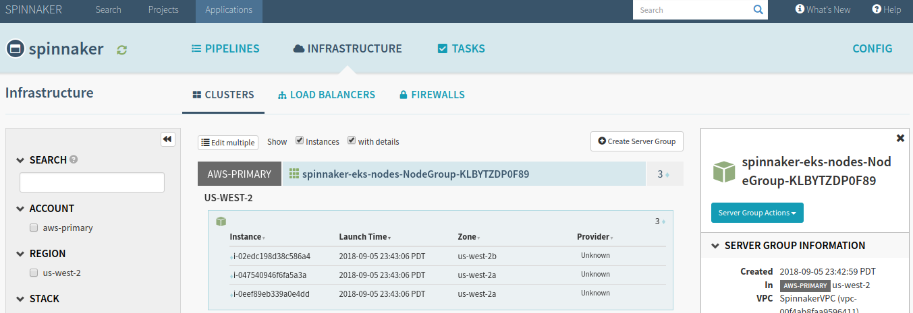

This chapter provides advanced developer tips for Chaos Monkey and other Chaos Engineering tools, including tutorials for manually deploying Spinnaker stacks on a [local machine][#spinnaker-install], [virtual machine][#spinnaker-manual], or [with Kubernetes][#spinnaker-stack-with-kubernetes].  From there you can configure and [deploy Spinnaker][#spinnaker-install] itself, along with [Chaos Monkey][#chaos-monkey-install] and [other Chaos Engineering tools][/alternatives]!

## How to Install AWS CLI

Start by installing the [AWS CLI tool](https://docs.aws.amazon.com/cli/latest/userguide/installing.html) on your machine, if necessary.


You can make future AWS CLI commands easier by creating AWS `profiles`, which will add configuration and credentials to the local `~/.aws/credentials` file.  In some cases you'll be using two different accounts/profiles, so you can add the credentials for multiple accounts to `~/.aws/credentials` by using `aws configure --profile <profile-name>` commands.
```bash
aws configure --profile spinnaker-developer
AWS Access Key ID [None]: <AWS_ACCESS_KEY_ID>
AWS Secret Access Key [None]: <AWS_SECRET_ACCESS_KEY>
Default region name [None]: us-west-2
Default output format [None]: text
   
aws configure --profile primary
AWS Access Key ID [None]: <AWS_ACCESS_KEY_ID>
AWS Secret Access Key [None]: <AWS_SECRET_ACCESS_KEY>
Default region name [None]: us-west-2
Default output format [None]: text
```

In the future, simply add the `--profile <profile-name>` flag to any AWS CLI command to force AWS CLI to use that account.


## How to Install Halyard

[Halyard](https://www.spinnaker.io/setup/install/halyard/) is the CLI tool that manages Spinnaker deployments and is typically the first step to any manual Spinnaker setup.

1. Download Halyard installation script.
    - For Debian/Ubuntu.
        ```bash
        curl -O https://raw.githubusercontent.com/spinnaker/halyard/master/install/debian/InstallHalyard.sh
        ```
    - For MacOS.
        ```bash
        curl -O https://raw.githubusercontent.com/spinnaker/halyard/master/install/macos/InstallHalyard.sh
        ```

2. Install Halyard with the `InstallHalyard.sh` script.  If prompted, default options are usually just fine.
    ```bash
    sudo bash InstallHalyard.sh
    ```

3. Source your recently-modified `.bashrc` file (or `~/.bash_profile`).
    ```bash
    . ~/.bashrc
    ```

4. Verify Halyard was installed by checking the version.

    ```bash
    hal -v
    # OUTPUT
    1.9.1-20180830145737
    ```

5. That's the basics!  Halyard is now ready to be configured and used for [manual][#spinnaker-manual] or [quick start][#spinnaker-quick-start] Spinnaker deployments.

## How to Install Spinnaker

This section walks you through the most basic Spinnaker installation process, suitable for simple Spinnaker deployments.

1. Use the `hal version list` command to view the current Spinnaker version list.

    ```bash
    hal version list
    ```

2. Configure Halyard to use the latest version of Spinnaker.

    ```bash
    hal config version edit --version 1.9.2
    ```

3. *(Optional)* Enable Chaos Monkey in the Halyard config.

    ```bash
    hal config features edit --chaos true
    ```

4. Tell Halyard what type of environment you're deploying Spinnaker to.  Most production setups will want to use Kubernetes or another distributed solution, but the default deployment is a local installation.  The `hal config deploy edit --type` flag can be used to change the environment.

    ```bash
    hal config deploy edit --type localdebian
    ```

5. Halyard requires some form of persistent storage, so we'll use AWS S3 for simplicity.  Modify the Halyard config and be sure to pass an AWS `ACCESS_KEY_ID` and `SECRET_ACCESS_KEY` with privileges to create and use S3 buckets.

    ```bash
    hal config storage s3 edit --access-key-id <AWS_ACCESS_KEY_ID> --secret-access-key --region us-west-2
    ```

6. Configure Halyard to use the `s3` storage type.

    ```bash
    hal config storage edit --type s3
    ```

7. Now use `sudo hal deploy apply` to deploy Spinnaker to the local machine.

    ```bash
    sudo hal deploy apply
    ```

8. After deployment finishes you should have a functioning Spinnaker installation!  If you've installed on your local machine you can navigate to the Spinnaker Deck UI at [localhost:9000](http://localhost:9000) to see it in action.  If Spinnaker was deployed on a remote machine use the `hal deploy connect` command to quickly establish SSH tunnels and connect.

### Next Steps

You're now ready to [install][#chaos-monkey-install] and then start [using Chaos Monkey][#chaos-monkey-use] or other [Simian Army][/simian-army] tools.

## How to Deploy a Spinnaker Stack for Chaos Monkey

Manually deploying Spinnaker with the help of Halyard is the best way to have the utmost control over your Spinnaker installation, and is ideal for advanced deployments to EC2 instances, EKS/Kubernetes clusters, and the like.  Choose one of the three options depending on your needs.

- [Deploying a Spinnaker Stack with AWS Console][#spinnaker-stack-with-aws-console]
- [Deploying a Spinnaker Stack with AWS CLI][#spinnaker-stack-with-aws-cli]
- [Deploying a Spinnaker Stack with Kubernetes][#spinnaker-stack-with-kubernetes]

After Spinnaker is running on your chosen platform proceed to our [How to Install Chaos Monkey][#chaos-monkey-install] guide to get started with Chaos Monkey!

### Deploying a Spinnaker Stack with AWS Console

This section will guide you through deploying a Spinnaker stack with the AWS web console.

#### Prerequisites

- **[Install Halyard][#halyard-install]**

1. In AWS navigate to **CloudFormation** and click **Create Stack**.
2. Download [this](https://d3079gxvs8ayeg.cloudfront.net/templates/managing.yaml) `managing.yaml` file to your local machine.
3. Under **Choose a template** click the **Choose File** button under **Upload a template to Amazon S3** and select the downloaded `managing.yaml`.
4. Click **Next**.
5. Input `spinnaker-managing-infrastructure-setup` into the **Stack name** field.
6. Select `false` in the **UseAccessKeyForAuthentication** dropdown.
7. Click **Next**.
8. On the **Options** screen leave defaults and click **Next**.
9. Check the **I acknowledge that AWS CloudFormation might create IAM resources with custom names.** checkbox and click **Create** to generate the stack.

    > note "Note"
    > If your AWS account already contains the `BaseIAMRole` AWS::IAM::ROLE you may have to delete it before this template will succeed.

10. Once the `spinnaker-managing-infrastructure-setup` stack has a `CREATE_COMPLETE` **Status**, select the **Outputs** tab and copy all `key/value` pairs there somewhere convenient.  They'll look something like the following.

    | Key | Value |
    | --- | --- |
    | VpcId | vpc-0eff1ddd5f7b26ffc |
    | ManagingAccountId | 123456789012 |
    | AuthArn | arn:aws:iam::123456789012:role/SpinnakerAuthRole |
    | SpinnakerInstanceProfileArn | arn:aws:iam::123456789012:instance-profile/spinnaker-managing-infrastructure-setup-SpinnakerInstanceProfile-1M72QQCCLNCZ9 |
    | SubnetIds | subnet-0c5fb1e7ab00f20a7,subnet-065af1a1830937f86 |

11. Add a new AWS account to Halyard named `spinnaker-developer` with your AWS account id and your appropriate AWS region name.

    ```bash
    hal config provider aws account add spinnaker-developer \
    --account-id 123456789012 \
    --assume-role role/spinnakerManaged \
    --regions us-west-2
    ```

12. Enable AWS in Halyard.

    ```bash
    hal config provider aws enable
    ```

#### Next Steps

You're now ready to [install Spinnaker][#spinnaker-install] and [install Chaos Monkey][#chaos-monkey-install] to begin Chaos Experimentation!

### Deploying a Spinnaker Stack with AWS CLI

This section will guide you through deploying a Spinnaker stack with the AWS CLI tool.

#### Prerequisites

- **[Install Halyard][#halyard-install]**
- **[Install AWS CLI][#aws-cli-install]**

1. Download [this](https://d3079gxvs8ayeg.cloudfront.net/templates/managing.yaml) `managing.yaml` template.

    ```bash
    curl -OL https://d3079gxvs8ayeg.cloudfront.net/templates/managing.yaml
    ```

2. Now we'll use AWS CLI to create the `spinnaker-managing-infrastructure` stack via CloudFormation.  We want to use the `primary` or managing account for this, so we'll specify the `--profile primary`, which will grab the appropriate credentials, region, and so forth.

    ```bash
    aws cloudformation deploy --stack-name spinnaker-managing-infrastructure --template-file managing.yaml --parameter-overrides UseAccessKeyForAuthentication=true --capabilities CAPABILITY_NAMED_IAM --profile primary
    ```

> error "Error: Unresolved resource dependency for `SpinnakerInstanceProfile`."
> If you receive the above error while creating the `spinnaker-managing-infrastructure` stack you may need to edit the `managing.yaml` file and comment out the two `SpinnakerInstanceProfileArn` related lines under the `Outputs` block.
> ```bash
> # ...
> Outputs:
> # ...
> #  SpinnakerInstanceProfileArn:
> #    Value: !GetAtt SpinnakerInstanceProfile.Arn
> ```

3. Once the `spinnaker-managing-infrastructure` stack has been created open the AWS console, navigate to the `CloudFormation` service, select the **Outputs** tab of the `spinnaker-managing-infrastructure` stack.  We'll be using the `ManagingAccountId` and `AuthArn` values in the next step, which look something like the following.

    | Key | Value |
    | --- | --- |
    | ManagingAccountId | 123456789012 |
    | AuthArn | arn:aws:iam::123456789012:user/spinnaker-managing-infrastructure-SpinnakerUser-15UU17KIS3EK1 |

4. Download [this](https://d3079gxvs8ayeg.cloudfront.net/templates/managed.yaml) `managed.yaml` template.

    ```bash
    curl -OL https://d3079gxvs8ayeg.cloudfront.net/templates/managed.yaml
    ```

5. Now enter the following command to create the companion `spinnaker-managed-infrastructure` stack in CloudFormation.  Be sure to specify the **profile** value and paste the appropriate `ManagingAccountId` and `AuthArn` values from above.

    ```bash
    aws cloudformation deploy --stack-name spinnaker-managed-infrastructure --template-file managed.yaml \
    --capabilities CAPABILITY_NAMED_IAM --profile spinnaker-developer --parameter-overrides \
    AuthArn=<ManagingStack_AuthArnValue> \
    ManagingAccountId=<ManagingStack_ManagingAccountId>
    ```

6. Add your AWS Access Id and Secret Keys to Halyard.

    ```bash
    hal config provider aws edit --access-key-id <AWS_ACCESS_KEY_ID> --secret-access-key
    ```

7. Add your default managing account to Spinnaker.

    ```bash
    hal config provider aws account add default --account-id 123456789012 --assume-role role/spinnakerManaged --regions us-west-2
    ```

    > info ""
    > Spinnaker uses `accounts` added via the Halyard `hal config provider aws account` API to handle all actions performed within the specified provider (such as AWS, in this case).  For this example we'll just be using our primary managing account, but you can freely add more accounts as needed.

8. Enable the AWS provider.

    ```bash
    hal config provider aws enable
    ```

#### Next Steps

With Spinnaker configured it's now time to [install Spinnaker][#spinnaker-install] and then [install Chaos Monkey][#chaos-monkey-install].

### Deploying a Spinnaker Stack with Kubernetes

Follow these steps to setup a CloudFormation EKS/Kubernetes stack for Spinnaker and Chaos Monkey.

#### Prerequisites

- **[Install Halyard][#halyard-install]**
- **[Install AWS CLI][#aws-cli-install]**

1. Download [this](https://d3079gxvs8ayeg.cloudfront.net/templates/managing.yaml) `managing.yaml` template.

    ```bash
    curl -O https://d3079gxvs8ayeg.cloudfront.net/templates/managing.yaml
    ```

    > info "Stack Configuration"
    > If you need to configure the stack to your own particular needs you can easily edit the template YAML as necessary.  For example, in this guide we're only using a single **managing** account to handle Spinnaker/Kubernetes in AWS, but if you need to also include additional **managed** accounts you'll want to add their respective AWS ARN strings to the `managing.yaml` file [around this line](https://gist.github.com/GabeStah/524fdb512e65e354076d71e53d9994eb#file-managing-yaml-L158).

2. Now we'll use AWS CLI to issue a `cloudformation deploy` command to create a new `spinnaker-managing-infrastructure-setup` stack using the `managing.yaml` template.  From here on out this guide will use explicit names where applicable, but feel free to customize options as you see fit (such as the **stack name**, **EksClusterName**, and so forth).

    ```bash
    aws cloudformation deploy --stack-name spinnaker-managing-infrastructure-setup --template-file managing.yaml --capabilities CAPABILITY_NAMED_IAM \
    --parameter-overrides UseAccessKeyForAuthentication=false EksClusterName=spinnaker-cluster
    ```

3. The step above takes 10 - 15 minutes to complete, but once complete issue the following commands, which will use the AWS CLI to assign some environment variables values from the `spinnaker-managing-infrastructure-setup` stack we just created.  We'll be using these values throughout the remainder of this guide.

    ```bash
    VPC_ID=$(aws cloudformation describe-stacks --stack-name spinnaker-managing-infrastructure-setup --query 'Stacks[0].Outputs[?OutputKey==`VpcId`].OutputValue' --output text)
    CONTROL_PLANE_SG=$(aws cloudformation describe-stacks --stack-name spinnaker-managing-infrastructure-setup --query 'Stacks[0].Outputs[?OutputKey==`SecurityGroups`].OutputValue' --output text)
    AUTH_ARN=$(aws cloudformation describe-stacks --stack-name spinnaker-managing-infrastructure-setup --query 'Stacks[0].Outputs[?OutputKey==`AuthArn`].OutputValue' --output text)
    SUBNETS=$(aws cloudformation describe-stacks --stack-name spinnaker-managing-infrastructure-setup --query 'Stacks[0].Outputs[?OutputKey==`SubnetIds`].OutputValue' --output text)
    MANAGING_ACCOUNT_ID=$(aws cloudformation describe-stacks --stack-name spinnaker-managing-infrastructure-setup --query 'Stacks[0].Outputs[?OutputKey==`ManagingAccountId`].OutputValue' --output text)
    EKS_CLUSTER_ENDPOINT=$(aws cloudformation describe-stacks --stack-name spinnaker-managing-infrastructure-setup --query 'Stacks[0].Outputs[?OutputKey==`EksClusterEndpoint`].OutputValue' --output text)
    EKS_CLUSTER_NAME=$(aws cloudformation describe-stacks --stack-name spinnaker-managing-infrastructure-setup --query 'Stacks[0].Outputs[?OutputKey==`EksClusterName`].OutputValue' --output text)
    EKS_CLUSTER_CA_DATA=$(aws cloudformation describe-stacks --stack-name spinnaker-managing-infrastructure-setup --query 'Stacks[0].Outputs[?OutputKey==`EksClusterCA`].OutputValue' --output text)
    SPINNAKER_INSTANCE_PROFILE_ARN=$(aws cloudformation describe-stacks --stack-name spinnaker-managing-infrastructure-setup --query 'Stacks[0].Outputs[?OutputKey==`SpinnakerInstanceProfileArn`].OutputValue' --output text)
    ```

    > info ""
    > You can easily output the value of an exported variable with `echo $VARIABLE_NAME`.  However, remember that unless you `export` these values they only temporarily exist in the console in which you issued the commands.  You may need to reissue the above commands later in the guide if you change terminal windows, so keep them handy.

4. Download [this](https://d3079gxvs8ayeg.cloudfront.net/templates/managed.yaml) `managed.yaml` template.  This template will create the `spinnakerManaged` **AWS::IAM::Role** that Spinnaker can use.

    ```bash
    curl -O https://d3079gxvs8ayeg.cloudfront.net/templates/managed.yaml
    ```

5. Execute this secondary CloudFormation deployment using the `managed.yaml`.  Notice that this command (and many following commands) use some of the environmental variables we assigned previously, so the first stack deployment will need to be complete first.

    ```bash
    aws cloudformation deploy --stack-name spinnaker-managed-infrastructure-setup --template-file managed.yaml --capabilities CAPABILITY_NAMED_IAM \
    --parameter-overrides AuthArn=$AUTH_ARN ManagingAccountId=$MANAGING_ACCOUNT_ID
    ```

    > info ""
    > If the second step of deploying `spinnaker-managing-infrastructure-setup` hasn't completed yet, feel free to skip this step for the time being and proceed with installing `kubectl` and `AWS IAM Authenticator` below.  Just return to this step before moving past that point.

#### Next Steps

You now have an EKS/Kubernetes CloudFormation stack ready for Spinnaker.  You can now proceed with the [deployment of Spinnaker on Kubernetes][#spinnaker-kubernetes], and then move on to [installing and using Chaos Monkey][#chaos-monkey-install].  If Chaos Monkey doesn't suit all your Chaos Engineering needs check out our [Chaos Monkey Alternatives][/alternatives] chapter.

## How to Deploy Spinnaker on Kubernetes

This guide will walk you through the entire process of setting up a Kubernetes cluster via AWS EKS, attaching some worker nodes (i.e. EC2 instances), deploying Spinnaker to manage the Kubernetes cluster, and then using Chaos Monkey and other Simian Army tools on it!  If you're looking for a simpler Spinnaker installation, you might be interested in our [Spinnaker AWS Quick Start][#spinnaker-quick-start] guide.

### Prerequisites

- **[Install Halyard][#halyard-install]**
- **[Install AWS CLI][#aws-cli-install]**
- **[Deploy a Spinnaker Stack for Kubernetes][#spinnaker-stack-with-kubernetes]**

### Install Kubectl

We'll need to install the `kubectl` client and the `AWS IAM Authenticator for Kubernetes`, which will allow Amazon EKS to use IAM for authentication to our Kubernetes cluster.

1. Download the appropriate `kubectl` binary.  *Note: For the remainder of this guide we'll be using Linux examples, but most everything applies to other environments.*

    - Linux: https://amazon-eks.s3-us-west-2.amazonaws.com/1.10.3/2018-07-26/bin/linux/amd64/kubectl
    - MacOS: https://amazon-eks.s3-us-west-2.amazonaws.com/1.10.3/2018-07-26/bin/darwin/amd64/kubectl
    - Windows: https://amazon-eks.s3-us-west-2.amazonaws.com/1.10.3/2018-07-26/bin/windows/amd64/kubectl.exe

    ```bash
    curl -O https://amazon-eks.s3-us-west-2.amazonaws.com/1.10.3/2018-07-26/bin/linux/amd64/kubectl
    ```

2. Change permissions of `kubectl` so it's executable.

    ```bash
    chmod +x ./kubectl
    ```

3. Move `kubectl` to an appropriate `bin` directory and add to your `PATH`, if necessary.

    ```bash
    cp ./kubectl $HOME/bin/kubectl && export PATH=$HOME/bin:$PATH
    ```

4. Verify that `kubectl` is installed.  The `--client` flag is used here since we're just checking for the local installation, not making any connections yet.

    ```bash
    kubectl version --client
    ```

### Install AWS IAM Authenticator

We'll follow the same basic steps as above to install the AWS IAM Authenticator as well.

1. Download the appropriate `aws-iam-authenticator` binary.

    - Linux: https://amazon-eks.s3-us-west-2.amazonaws.com/1.10.3/2018-07-26/bin/linux/amd64/aws-iam-authenticator
    - MacOS: https://amazon-eks.s3-us-west-2.amazonaws.com/1.10.3/2018-07-26/bin/darwin/amd64/aws-iam-authenticator
    - Windows: https://amazon-eks.s3-us-west-2.amazonaws.com/1.10.3/2018-07-26/bin/windows/amd64/aws-iam-authenticator.exe

    ```bash
    curl -O https://amazon-eks.s3-us-west-2.amazonaws.com/1.10.3/2018-07-26/bin/linux/amd64/aws-iam-authenticator
    ```

2. Make `aws-iam-authenticator` executable.

    ```bash
    chmod +x ./aws-iam-authenticator
    ```

3. Move `aws352-iam-authenticator` to an appropriate `bin` directory and add to your `PATH`, if necessary.

    ```bash
    cp ./aws-iam-authenticator $HOME/bin/aws-iam-authenticator && export PATH=$HOME/bin:$PATH
    ```

4. Test the `aws-iam-authenticator` installation.

    ```bash
    aws-iam-authenticator help
    ```

### Configure Kubectl

#### Prerequisites

- Make sure you've gone through the [Deploying a Spinnaker Stack with Kubernetes][#spinnaker-stack-with-kubernetes] section.

With everything setup you can now edit the `kubectl` configuration files, which will inform `kubectl` how to connect to your Kubernetes/EKS cluster.

1. Copy and paste the following into the `~/.kube/config` file.

    ```yaml
    apiVersion: v1
    clusters:
    - cluster:
        server: <endpoint-url>
        certificate-authority-data: <base64-encoded-ca-cert>
      name: kubernetes
    contexts:
    - context:
        cluster: kubernetes
        user: aws
      name: aws
    current-context: aws
    kind: Config
    preferences: {}
    users:
    - name: aws
      user:
        exec:
          apiVersion: client.authentication.k8s.io/v1alpha1
          command: aws-iam-authenticator
          args:
            - "token"
            - "-i"
            - "<cluster-name>"
            # - "-r"
            # - "<role-arn>"
          # env:
            # - name: AWS_PROFILE
            #   value: "<aws-profile>"
    ```

    > info "Configuring Multiple Kubernetes Clusters"
    > This guide assumes you're just configuring `kubectl` to handle a single Kubernetes cluster, but if you need to configure and handle multiple clusters the convention for doing so is to create a unique `config` file for each cluster.  Simply name each `config` file `~/.kube/config-<cluster-name>`, where `<cluster-name>` is replaced by the name of the Kubernetes cluster you already created.

2. Replace the `<...>` placeholder strings with the following `EKS_CLUSTER_` environmental variable values from earlier:
  
    - `<endpoint-url>`: `$EKS_CLUSTER_ENDPOINT`
    - `<base64-encoded-ca-cert>`: `$EKS_CLUSTER_CA_DATA`
    - `<cluster-name>`: `$EKS_CLUSTER_NAME`

    > info "Using a Specific `AWS::IAM::Role`"
    > If you need to have the AWS IAM Authenticator and kubectl use a specific `Role` then uncomment the `- "-r"` and `- "<role-arn>"` lines and paste the `AWS::IAM::Role` ARN in place of `<role-arn>`.

3. Your `~/.kube/config` file should now look something like this:

    ```yaml
    apiVersion: v1
    clusters:
    - cluster:
        server: https://51A93D4A4B1228D6D06BE160DA2D3A8A.yl4.us-west-2.eks.amazonaws.com
        certificate-authority-data: LS0tLS1CRUdJTiBDRVJUSUZJQ0FURS0tLS0tCk1JSUN5RENDQWJDZ0F3SUJBZ0lCQURBTkJna3Foa2lHOXcwQkFRc0ZBREFWTVJNd0VRWURWUVFERXdwcmRXSmwKY201bGRHVnpNQjRYRFRFNE1Ea3dOakExTVRnME1BHeGFNN3QyaApzcm8wa1ZOWTdCQ1g5YVBBY09rRFVuRExGektpZTJnZVZLOFpxVHJvZEpLR0p3SEtjVDJNNUtsR0ZTSjMzSGpoCk5ZeVErTnJkd0VKT2puR2xZN3R1eVFvZjhnNU0vNWZzZSt0TWFMTjJjQ3NWNFA1NCCi93UUZNQU1CQWY4d0RRWUpLb1pJaHZjTkFRRUxCUUFEZ2dFQkFKN3owTEI5NFVoZWNwTUh0VGYrVTkxVDlxU2IKNWFVRGQrdlVTNEpVTWwwdk01OXBqc05CNDU1Z1l6ZkpLelZ1YXI5TjJOVURiREllNUJsbjlCRjWb1hEVEk0TURrd016QTFNVGcwTVZvd0ZURVRNQkVHQTFVRQpBeE1LYTNWaVpYSnVaWFJsY3pDQ0FTSXdEUVlKS29aSWh2Y05BUUVCQlFBRGdnRVBBRENDQVFvQ2dnRUJBT0h6CldrZ2pzTWZ0eEJYd3NZOGRuVXI5UUQTAzZXczazlaZHZlMWNYRlp4bHdqc3RSdWN3eUxRTG12eUh0VzJsTjE4RENqSXF5OGwxeUlYSENERQpXQjI3eHo4TXg3ZDJVSjIyaThjQ0F3RUFBYU1qTUNFd0RnWURWUjBQQVFIL0JBUURBZ0trTUE4R0ExVWRFd0V5OSTJHYjV4QU1vYjJBaWQwbEQrT2NncGdDcXQvQ3h2SlFJRGpxbjRKT1AKejh6RVkvWVVsQjBUOTVXUUFsRE9ZWnlKY3lDeWxYcFZRTnNDRWNSMFhUakRaVDFVbXMyMmk4NlozYy8xQ1IrWgpKNkNqZ3IvZkNadVVaV0VUbGt1WXhlSG5CQS91ZURJM1NsMVdnY0ZFMGFyNGxsVkVFVngyS01PZXhuM09FdHI0CjhBd1dmQWxzSUNXRWdjMjRKdzk5MG9LelNObXB0cWRaOEFwczhVaHJoZWtoNEh1blpFLzhud1prb213SE1TcTYKbjl5NFJN3RyR0xWN0RzMUxWUFBlWjkKVVB0eU1WODlieFVEeFhNV3I3d2tNRy9YckdtaC9nN1gwb1grdXRnUUtiSWdPaHZMZEFKSDNZUUlyTjhHS0krcwpIMGtjTnpYMWYzSGdabUVINUIxNXhER0R2SnA5a045Q29VdjRYVE5tdlljVlNVSy9vcWdwaXd1TU9oZz0KLS0tLS1FTkQgQ0VSVElGSUNBVEUtLS0tLQo=
      name: kubernetes
    contexts:
    - context:
        cluster: kubernetes
        user: aws
      name: aws
    current-context: aws
    kind: Config
    preferences: {}
    users:
    - name: aws
      user:
        exec:
          apiVersion: client.authentication.k8s.io/v1alpha1
          command: aws-iam-authenticator
          args:
            - "token"
            - "-i"
            - "spinnaker-cluster"
            # - "-r"
            # - "<role-arn>"
          # env:
            # - name: AWS_PROFILE
            #   value: "<aws-profile>"
    ```

4. Save your `config` file and export the `KUBECONFIG` variable to include the new `config` location.

    ```bash
    export KUBECONFIG=$KUBECONFIG:~/.kube/config
    ```

5. Verify that `kubectl` is able to use your credentials to connect to your cluster with `kubectl get svc`:

    ```bash
    kubectl get svc

    NAME         TYPE        CLUSTER-IP   EXTERNAL-IP   PORT(S)   AGE
    kubernetes   ClusterIP   172.25.0.1   <none>        443/TCP   31m
    ```

### Create AWS Accounts and Roles

We now need to apply service accounts and roles to the `kubectl` `spinnaker` namespace.  In Kubernetes, a [namespace](https://kubernetes.io/docs/concepts/overview/working-with-objects/namespaces/) is a *virtual* cluster, which can join other virtual clusters and all be housed within the same *physical* cluster.

1. Issue the following commands to create the `spinnaker` namespace, `spinnaker-service-account` service account, and `spinnaker-admin` binding.  The [`apply`](https://kubernetes.io/docs/reference/generated/kubectl/kubectl-commands#apply) command in `kubectl` applies a configuration based on the passed resource (YAML files, in this case).

    ```bash
    CONTEXT=aws
    kubectl create namespace spinnaker
    kubectl apply -f https://d3079gxvs8ayeg.cloudfront.net/templates/spinnaker-service-account.yaml
    kubectl apply -f https://d3079gxvs8ayeg.cloudfront.net/templates/spinnaker-cluster-role-binding.yaml
    ```

2. Next, we're creating the authentication `TOKEN` environmental variable.

    ```bash
    TOKEN=$(kubectl get secret --context $CONTEXT \
      $(kubectl get serviceaccount spinnaker-service-account \
          --context $CONTEXT \
          -n spinnaker \
          -o jsonpath='{.secrets[0].name}') \
      -n spinnaker \
      -o jsonpath='{.data.token}' | base64 --decode)
    ```

3. Pass the `TOKEN` to the following configuration commands to set `kubectl` credentials.

    ```bash
    kubectl config set-credentials ${CONTEXT}-token-user --token $TOKEN
    kubectl config set-context $CONTEXT --user ${CONTEXT}-token-user
    ```

### Add Kubernetes Provider to Halyard

The next step is to add Kubernetes as a provider to Halyard/Spinnaker. A [provider](https://www.spinnaker.io/concepts/providers/) is just an interface to one of many virtual resources Spinnaker will utilize.  AWS, Azure, Docker, and many more are all considered providers, and are managed by Spinnaker via `accounts`.

1. Start by enabling the Kubernetes provider in Halyard.4

    ```bash
    hal config provider kubernetes enable
    ```

2. Add the `kubernetes-master` account to Halyard.

    ```bash
    hal config provider kubernetes account add kubernetes-master --provider-version v2 --context $(kubectl config current-context)`
    ```

3. Enable the `artifacts` and `chaos` features of Halyard.  [Artifacts](https://www.spinnaker.io/reference/artifacts/) in Spinnaker merely reference any external resource, such as a remote file, a binary blob, and image, and so forth.  The `chaos` feature allows us to utilize Chaos Monkey, the base form of which is built into Spinnaker by default.

    ```bash
    hal config features edit --artifacts true
    hal config features edit --chaos true
    ```

### Add AWS Provider to Halyard

Now we need to also add AWS as another provider and account.  Be sure to replace `<AWS_ACCOUNT_ID>` with the primary/managing account ID of your AWS account.

```bash
hal config provider aws account add aws-primary --account-id <AWS_ACCOUNT_ID> --assume-role role/spinnakerManaged
hal config provider aws enable
```

### Add ECS Provider to Halyard

The last provider to enable is ECS.  We'll add the `ecs-primary` account to Halyard and associate it with the `aws-primary` AWS account added above:

```bash
hal config provider ecs account add ecs-primary --aws-account aws-primary
hal config provider ecs enable
```

### Use Distributed Deployment

We also need to ensure Halyard deploys Spinnaker in a distributed fashion among our Kubernetes cluster.  Without this step, the default configuration is to deploy Spinnaker onto the local machine.

```bash
hal config deploy edit --type distributed --account-name kubernetes-master
```

> error "Error: `kubectl` not installed, or can't be found by Halyard."
> If you get such an error when issuing the distributed deployment command above, it likely means Halyard just needs to be restarted.  Simply issue the `hal shutdown` command to stop the Halyard daemon, then retry the deployment edit command again, which will automatically restart Halyard before executing.

### Use S3 for Persistent Storage

Let's tell Spinnaker to use AWS S3 for storing persistent data (in this case, creating a small S3 bucket).  Issue the following command by replacing `<AWS_ACCESS_KEY_ID>` with any AWS access key that has full S3 service privileges.

```bash
hal config storage s3 edit --access-key-id <AWS_ACCESS_KEY_ID> --secret-access-key --region us-west-2
hal config storage edit --type s3
```

### Create Kubernetes Worker Nodes

Now we'll launch some AWS EC2 instances which will be our worker nodes for our Kubernetes cluster to manage.

1. Download [this](https://d3079gxvs8ayeg.cloudfront.net/templates/amazon-eks-nodegroup.yaml) `amazon-eks-nodegroup.yml` template file.

    ```bash
    curl -O https://d3079gxvs8ayeg.cloudfront.net/templates/amazon-eks-nodegroup.yaml
    ```

    > info "Adjust Worker Nodes"
    > The default template creates an auto-balancing collection of up to **3** worker nodes (instances).  Additionally, the deployment command we'll be using below specifies `t2.large` instance types.  As always, feel free to modify the `amazon-eks-nodegroup.yaml` or instance types to meet your needs.

2. Issue the following command to use the template and create your worker node collection.

    ```bash
    aws cloudformation deploy --stack-name spinnaker-eks-nodes --template-file amazon-eks-nodegroup.yaml \
    --parameter-overrides NodeInstanceProfile=$SPINNAKER_INSTANCE_PROFILE_ARN \
    NodeInstanceType=t2.large ClusterName=$EKS_CLUSTER_NAME NodeGroupName=spinnaker-cluster-nodes ClusterControlPlaneSecurityGroup=$CONTROL_PLANE_SG \
    Subnets=$SUBNETS VpcId=$VPC_ID --capabilities CAPABILITY_NAMED_IAM
    ```

3. To connect up our newly-launched worker instances with the Spinnaker cluster we previously deployed we need to create a new `~/.kube/aws-auth-cm.yaml` file.  Paste the following text into `aws-auth-cm.yaml`, replacing `<AUTH_ARN>` with the `AUTH_ARN` variable created previously (Remember, you can use `echo $AUTH_ARN` to print to console).

    ```yaml
    apiVersion: v1
    kind: ConfigMap
    metadata:
      name: aws-auth
      namespace: kube-system
    data:
      mapRoles: |
        - rolearn: <AUTH_ARN>
          username: system:node:{{EC2PrivateDNSName}}
          groups:
            - system:bootstrappers
            - system:nodes
    ```

4. Apply this newly created role mapping by issuing the following command.

    ```bash
    kubectl apply -f ~/.kube/aws-auth-cm.yaml
    ```

5. Check the status of your Kubernetes nodes with `kubectl get nodes`.  The `--watch` flag can be added to perform constant updates.  Once all nodes have a `Ready` **STATUS** you're all set to deploy Spinnaker.

    ```bash
    kubectl get nodes
    NAME                                          STATUS    ROLES     AGE       VERSION
    ip-10-100-10-178.us-west-2.compute.internal   Ready     <none>    2m        v1.10.3
    ip-10-100-10-210.us-west-2.compute.internal   Ready     <none>    2m        v1.10.3
    ip-10-100-11-239.us-west-2.compute.internal   Ready     <none>    2m        v1.10.3
    ```

### Deploy Spinnaker

1. Start by listing the current Spinnaker versions with `hal version list`:

    ```bash
    hal version list
    ```

2. Specify the version you wish to install with the `--version` flag below.  We'll be using the latest at the time of writing, `1.9.2`.

    ```bash
    hal config version edit --version 1.9.2
    ```

3. Now use `hal deploy apply` to deploy Spinnaker using all the configuration settings we've previously applied.  This will go about distributing Spinnaker in your EKS/Kubernetes cluster.

    ```bash
    hal deploy apply
    ```

    > error "Handling `hal deploy apply` Errors"
    > In some cases you may experience a deployment error, particularly when trying your first Spinnaker deployment.  Often the console output is quite vague, so the best course of action is to check your Spinnaker/Halyard log files.  Typically these are located in `/var/log/spinnaker` and `/var/log/spinnaker/halyard`.  Since Halyard runs on Java, logs let you see the entire Java error stack trace, rather than the basic (and often useless) error name.

    > error "Profile-related `IndexOutOfBoundsException`"
    > With recent Halyard/Spinnaker versions there's a [known bug](https://github.com/spinnaker/spinnaker/issues/3280) that you may experience in which an `IndexOutOfBoundsException` occurs during deployment when using the AWS provider.  The cause usually seems to be that Halyard is assuming an explicit `region` value in the YAML configuration file for the AWS account being used.  Even though the `aws` block in the config has a `defaultRegions` key, that seems to be ignored, which can cause this error.  The current solution is to manually edit the primary AWS account and explicitly set the `region` value, which should solve the issue and allow you to run a Spinnaker deployment.

```bash
hal config provider aws account edit aws-primary --add-region us-west-2
```

That's it, you should now have a Spinnaker deployment up and running on a Kubernetes cluster, using EKS and EC2 worker node instances!  Issue the `hal deploy connect` command to provide port forwarding on your local machine to the Kubernetes cluster running Spinnaker, then open [http://localhost:9000](http://localhost:9000) to make sure everything is up and running.

Select the `spinnaker` app and you should see your `aws-primary` account with a `spinnaker-eks-nodes-NodeGroup` containing your three EC2 worker node instances.



### Next Steps

From here you can [install][#chaos-monkey-install] and [start using Chaos Monkey][#chaos-monkey-use] to run Chaos Experiments directly on your Kubernetes cluster worker nodes!  Check out our [How to Install Chaos Monkey][#chaos-monkey-install] tutorial to get started.

