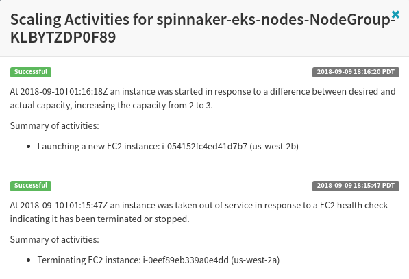

This chapter will provide a step-by-step guide for setting up and using Chaos Monkey with AWS.  We also examine a handful of scenarios in which Chaos Monkey is not always the most relevant solution for Chaos Engineering implementation, due to its Spinnaker requirements and limited scope of only handling instance terminations.

## How to Quickly Deploy Spinnaker for Chaos Monkey

Modern Chaos Monkey **requires** the use of [Spinnaker](https://www.spinnaker.io/), which is an open-source, multi-cloud continuous delivery platform developed by Netflix.  Spinnaker allows for automated deployments across multiple cloud platforms (such as AWS, Azure, Google Cloud Platform, and more).  Spinnaker can also be used to deploy across multiple accounts and regions, often using **pipelines** that define a series of events that should occur every time a new version is released.  Spinnaker is a powerful tool, but since both Spinnaker and Chaos Monkey were developed by and for Netflix's own network architecture, you'll need to do the extra legwork to configure Spinnaker to work within your application and infrastructure.

That said, in this first section we'll explore the fastest and simplest way to get Spinnaker up and running, which will then allow you to move onto [installing][#chaos-monkey-install] and then [using][#chaos-monkey-use].

We'll be deploying Spinnaker on AWS, and the easiest method for doing so is to use the [CloudFormation Quick Start](https://us-west-2.console.aws.amazon.com/cloudformation/home?region=us-west-2#/stacks/new?stackName=Spinnaker&templateURL=https:%2F%2Fs3.amazonaws.com%2Faws-quickstart%2Fquickstart-spinnaker%2Ftemplates%2Fquickstart-spinnakercf.template) template.

> info "Looking to Deploy Spinnaker In Another Environment?"
> If you're looking to have the utmost control over your Spinnaker deployment you should check out our [How to Manually Deploy Spinnaker for Chaos Monkey][#spinnaker-manual] guide, which provides a step-by-step tutorial for setting up Halyard and Spinnaker on a local or virtual machine of your choice.

The *AWS Spinnaker Quick Start* will create a simple architecture for you containing two Virtual Private Cloud (VPC) subnets (one public and one private).  The public VPC contains a [Bastion host](https://en.wikipedia.org/wiki/Bastion_host) instance designed to be strictly accessible, with just port 22 open for SSH access.  The Bastion host will then allow a pass through connection to the private VPC that is running Spinnaker.


*AWS Spinnaker Quick Start Architecture - **Courtesy of AWS***

This quick start process will take about 10 - 15 minutes and is mostly automated.

### Creating the Spinnaker Stack

1. *(Optional)* If necessary, visit [https://aws.amazon.com/](https://aws.amazon.com/) to sign up for or login to your AWS account.
2. *(Optional)* You'll need at least one AWS EC2 Key Pair for securely connecting via SSH.  
    1. If you don't have a KeyPair already start by opening the AWS Console and navigate to **EC2 > NETWORK & SECURITY > Key Pairs**.
    2. Click **Create Key Pair** and enter an identifying name in the **Key pair name** field.
    3. Click **Create** to download the private `.pem` key file to your local system.
    4. Save this key to an appropriate location (typically your local user `~/.ssh` directory).
3. After you've signed into the AWS console visit [this page](https://us-west-2.console.aws.amazon.com/cloudformation/home?region=us-west-2#/stacks/new?stackName=Spinnaker&templateURL=https:%2F%2Fs3.amazonaws.com%2Faws-quickstart%2Fquickstart-spinnaker%2Ftemplates%2Fquickstart-spinnakercf.template), which should load the [`quickstart-spinnakercf.template`](https://s3.amazonaws.com/aws-quickstart/quickstart-spinnaker/templates/quickstart-spinnakercf.template).
4. Click **Next**.
5. (Optional) If you haven't already done so, you'll need to create at least one AWS Access Key.
6. Select the **KeyName** of the key pair you previously created.
7. Input a secure password in the **Password** field.
8. *(Optional)* Modify the IP address range in the **SSHLocation** field to indicate what IP range is allowed to SSH into the Bastion host.  For example, if your public IP address is `1.2.3.4` you might enter `1.2.3.4/32` into this field.  If you aren't sure, you can enter `0.0.0.0/0` to allow any IP address to connect, though this is obviously less secure.
9. Click **Next**.
10. *(Optional)* Select an **IAM Role** with proper CloudFormation permissions necessary to deploy a stack.  If you aren't sure, leave this blank and deployment will use your account's permissions.
11. Modify any other fields on this screen you wish, then click **Next** to continue.
12. Check the **I acknowledge that AWS CloudFormation might create IAM resources with custom names.** checkbox and click **Create** to generate the stack.

    > warning ""
    > If your AWS account already contains the `BaseIAMRole` AWS::IAM::Role you may have to delete it before this template will succeed.

13. Once the `Spinnaker` stack has a `CREATE_COMPLETE` **Status**, select the **Outputs** tab, which has some auto-generated strings you'll need to paste in your terminal in the next section.

### Connecting to the Bastion Host

1. Copy the **Value** of the **SSHString1** field from the stack **Outputs** tab above.
2. Execute the **SSHString1** value in your terminal and enter `yes` when prompted to continue connecting to this host.

    ```bash
    ssh -A -L 9000:localhost:9000 -L 8084:localhost:8084 -L 8087:localhost:8087 ec2-user@54.244.189.78
    ```

    > error "Permission denied (publickey)."
    > If you received a permission denied SSH error you may have forgotten to place your `.pem` private key file that you downloaded from the AWS EC2 Key Pair creation page.  Make sure it is located in your `~/.ssh` user directory.  Otherwise you can specify the key by adding an optional `-i <identify_file_path>` flag, indicating the path to the `.pem` file.

3. You should now be connected as the `ec2-user` to the Bastion instance.  Before you can connect to the Spinnaker instance you'll probably need to copy your `.pem` file to the Spinnaker instance's `~/.ssh` directory.

    - Once the key is copied, make sure you set proper permissions otherwise SSH will complain.

        ```bash
        chmod 400 ~/.ssh/my_key.pem
        ```

### Connecting to the Spinnaker Host

1. To connect to the Spinnaker instance copy and paste the **SSHString2** **Value** into the terminal.

    ```bash
    ssh –L 9000:localhost:9000 -L 8084:localhost:8084 -L 8087:localhost:8087 ubuntu@10.100.10.167 -i ~/.ssh/my_key.pem
    ```

2. You should now be connected to the `SpinnakerWebServer`!

    > warning "System restart required"
    > Upon connecting to the Spinnaker instance you may see a message indicating the system needs to be restarted.  You can do this through the AWS EC2 console, or just enter the `sudo reboot` command in the terminal, then reconnect after a few moments.

### Configuring Spinnaker

The [Spinnaker architecture](https://www.spinnaker.io/reference/architecture/) is composed of a collection of microservices that each handle various aspects of the entire service.  For example, [Deck](https://github.com/spinnaker/deck) is the web interface you'll spend most time interacting with, [Gate](https://github.com/spinnaker/gate) is the API gateway that handles most communication between microservices, and [CloudDriver](https://github.com/spinnaker/clouddriver) is the service that communicates and configures all cloud providers Spinnaker is working with.

Since so much of Spinnaker is blown out into smaller microservices, configuring Spinnaker can require messing with a few different files.  If there's an issue you'll likely have to look through individual logs for each different service, depending on the problem.

Spinnaker is configured through `/opt/spinnaker/config/spinnaker.yml` file.  However, this file will be overwritten by Halyard or other changes, so for user-generated configuration you should actually modify the `/opt/spinnaker/config/spinnaker-local.yml` file.  Here's a basic example of what that file looks like.

```yaml
# /opt/spinnaker/config/spinnaker-local.yml

global:
  spinnaker:
    timezone: 'America/Los_Angeles'

providers:
  aws:
    # For more information on configuring Amazon Web Services (aws), see
    # http://www.spinnaker.io/v1.0/docs/target-deployment-setup#section-amazon-web-services-setup

    enabled: ${SPINNAKER_AWS_ENABLED:false}
    defaultRegion: ${SPINNAKER_AWS_DEFAULT_REGION:us-west-2}
    defaultIAMRole: Spinnaker-BaseIAMRole-GAT2AISI7TMJ
    primaryCredentials:
      name: default
      # Store actual credentials in $HOME/.aws/credentials. See spinnaker.yml
      # for more information, including alternatives.

    # {{name}} will be interpolated with the aws account name (e.g. "my-aws-account-keypair").
    defaultKeyPairTemplate: "{{name}}-keypair"

    # ...
```

Standalone Spinnaker installations (such as the one created via the [AWS Spinnaker Quick Start][#spinnaker-quick-start]) are configured directly through the `spinnaker.yml` and `spinnaker-local.yml` override configuration files.

### Creating an Application

In this section we'll manually create a Spinnaker **application** containing a **pipeline** that first *bakes* a virtual machine image and then *deploys* that image to a cluster.

1. Open the Spinnaker web UI (**Deck**) and click **Actions > Create Application**.
2. Input `bookstore` in the **Name** field.
3. Input your own email address in the **Owner Email** field.
4. (Optional) If you've enabled Chaos Monkey in Spinnaker you can opt to enable Chaos Monkey by checking the **Chaos Monkey > Enabled** box.
5. Input `My bookstore application` in the **Description** field.
6. Under **Instance Health**, tick the **Consider only cloud provider health when executing tasks** checkbox.
7. Click **Create** to add your new application.


### Adding a Firewall

1. Navigate to the `bookstore` application, **INFRASTRUCTURE > FIREWALLS**, and click **Create Firewall**.
2. Input `dev` in the **Detail** field.
3. Input `Bookstore dev environment` in the **Description** field.
4. Within the **VPC** dropdown select `SpinnakerVPC`.
5. Under the **Ingress** header click **Add new Firewall Rule**. Set the following **Firewall Rule** settings.
    - **Firewall**: `default`
    - **Protocol**: `TCP`
    - **Start Port**: `80`
    - **End Port**: `80`
6. Click the **Create** button to finalize the firewall settings.


### Adding a Load Balancer

1. Navigate to the `bookstore` application, **INFRASTRUCTURE > LOAD BALANCERS**, and click **Create Load Balancer**.
2. Select **Classic (Legacy)** and click **Configure Load Balancer**.
3. Input `test` in the **Stack** field.
4. In the **VPC Subnet** dropdown select `internal (vpc-...)`.
5. In the **Firewalls** dropdown select `bookstore--dev (...)`.
6. Click **Create** to generate the load balancer.


### Creating a Pipeline in Spinnaker

The final step is to add a **pipeline**, which is where we tell Spinnaker what it should actually "do"!  In this case we'll tell it to **bake** a virtual machine image containing [Redis](https://redis.io/), then to **deploy** that image to our waiting EC2 instance.

1. Navigate to the `bookstore` application, **PIPELINES** and click **Create Pipeline**.
2. Select `Pipeline` in the **Type** dropdown.
3. Input `Bookstore Dev to Test` in the **Pipeline Name** field.
4. Click **Create**.

#### Adding a Bake Stage

1. Click the **Add stage** button.
2. Under **Type** select `Bake`.
3. Input `redis-server` in the **Package** field.
4. Select `trusty (v14.04)` in the **Base OS** dropdown.
5. Click **Save Changes** to finalize the stage.


> note "Ignoring Jenkins/Travis"
> In production environments you'll likely also want to incorporate Travis, Jenkins, or another CI solution as a preceding stage to the **bake** stage.  Otherwise, Spinnaker will default to baking and deploying the most recently built package.  For our purposes here we don't care, since we're using an unchanging image.

#### Adding a Deploy Stage

1. Click the **Add stage** button.
2. Under **Type** select `Deploy`.
3. Click the **Add server group** button to begin creating a new server group.

#### Adding a Server Group

1. Select `internal (vpc-...)` in the **VPC Subnet** dropdown.
2. Input `dev` in the **Stack** field.
3. Under **Load Balancers > Classic Load Balancers** select the `bookstore-dev` load balancer we created.
4. Under **Firewalls > Firewalls** select the `bookstore--dev` firewall we also created.
5. Under **Instance Type** select the **Custom Type** of instance you think you'll need.  For this example we'll go with something small and cheap, such as `t2.large`.
6. Input `3` in the **Capacity > Number of Instances** field.
7. Under **Advanced Settings > Key Name** select the key pair name you used when [deploying][#spinnaker-quick-start] your Spinnaker CloudFormation stack.
8. In the **Advanced Settings > IAM Instance Profile** field input the **Instance Profile ARN** value of the `BaseIAMRole` found in the **AWS > IAM > Roles > BaseIAMRole** dialog (e.g. `arn:aws:iam::0123456789012:instance-profile/BaseIAMRole`).
9. We also need to ensure the `user/Spinnaker-SpinnakerUser` that was generated has permissions to perform to pass the `role/BasIAMRole` **role** during deployment.
    1. Navigate to **AWS > IAM > Users > Spinnaker-SpinnakerUser-### > Permissions**.
    2. Expand `Spinnakerpassrole` policy and click **Edit Policy**.
    3. Select the **JSON** tab and you'll see the auto-generated `Spinnaker-BaseIAMRole` listed in `Resources`.
    4. Convert the `Resource` key value to an array so you can add a second value.  Insert the **ARN** for the `role/BaseIAMRole` of your account (the account number will match the number above).

        ```json
        {
            "Version": "2012-10-17",
            "Statement": [
                {
                    "Sid": "VisualEditor0",
                    "Effect": "Allow",
                    "Action": "iam:PassRole",
                    "Resource": [
                        "arn:aws:iam::123456789012:role/Spinnaker-BaseIAMRole-6D9LJ9HS4PZ7",
                        "arn:aws:iam::123456789012:role/BaseIAMRole"
                    ]
                }
            ]
        }
        ```

    5. Click **Review Policy** and **Save Changes**.

10. Click the **Add** button to create the deployment cluster configuration.
11. Finally, click **Save Changes** again at the bottom of the **Pipelines** interface to save the full `Configuration > Bake > Deploy` pipeline.
12. You should now have a `Bookstore Dev to Test` two-stage **pipeline** ready to go!


### Executing the Pipeline

1. Navigate to the `bookstore` application, select **Pipelines**, and click **Start Manual Execution** next to the `Bookstore Dev to Test` pipeline.
2. Click **Run** to begin manual execution.
3. After waiting a few moments, assuming none of the potential setbacks below bite you, you'll shortly see output indicating the `bookstore-dev-v000` **Server Group** has been successfully created.  Browse over to **AWS > EC2** and you'll see your three new instances launched!


To resize this **Server Group** use the **Resize Server Group** dialog in Spinnaker.  Alternatively, you can find additional options under **Server Group Actions**, such as **Disable** or **Destroy** to stop or terminate instances, respectively.

#### Troubleshooting Pipeline Executions

While a lot can go wrong, below are a few potential issues you may encounter running through this tutorial, depending on changes to software versions, default configurations, and the like between present and time of writing.

> error "Error: Unknown configuration key `ena_support`"
> If you get an `ena_support` error during deployment (see: [#2237](https://github.com/spinnaker/spinnaker/issues/2237)) the solution is to *remove* the `ena_support` reference line  within the `builders` block in the `/opt/rosco/config/packer/aws-ebs.json` Rosco configuration file.
>
> ```bash
> sudo nano /opt/rosco/config/packer/aws-ebs.json
> ```
>
> ```json
> {
>   "builders": {
>     "aws_ena_support": "{{user `aws_ena_support`}}",
>   },
> }
> ```

> error "Error: `0.000000` is an invalid spot instance price"
> If you get such an error during deployment (see: [#2889](https://github.com/spinnaker/spinnaker/issues/2889)) the solution is to *remove* `spot_price` reference lines within the `builders` block in the `/opt/rosco/config/packer/aws-ebs.json` Rosco configuration file.
>
> ```bash
> sudo nano /opt/rosco/config/packer/aws-ebs.json
> ```
>
> ```json
> {
>   "builders": {
>     "spot_price": "{{user `aws_spot_price`}}",
>     "spot_price_auto_product": "{{user `aws_spot_price_auto_product`}}",
>   },
> }
> ```

> error "Error: Bake stage failure after provisioning `install_packages.sh` script"
> This error is typically due to an outdated `install_packages.sh` script.  To resolve this override with the latest downloaded version.
>
> ```bash
> sudo curl https://raw.githubusercontent.com/spinnaker/rosco/master/rosco-web/config/packer/install_packages.sh --output /opt/rosco/config/packer/install_packages.sh
> ```

## How to Install Chaos Monkey

Before you can use Chaos Monkey you'll need to have Spinnaker deployed and running.  We've created a handful of step-by-step tutorials for deploying Spinnaker, depending on the environment and level of control you're looking for.

- [How to Quickly Deploy Spinnaker for Chaos Monkey][#spinnaker-quick-start] will guide you through a rapid deployment of Spinnaker on AWS.
- [How to Manually Deploy Spinnaker for Chaos Monkey][#spinnaker-manual] provides a much more in-depth tutorial for installing Spinnaker as it was intended, with the help of the Halyard tool, on a local or virtual machine.

### Installing MySQL

Chaos Monkey requires MySQL, so make sure it's installed on your local system.

> warning "Warning"
> Chaos Monkey is currently *incompatible* with MySQL version 8.0 or higher, so 5.X is recommended.

1. Download the latest `mysql-apt.deb` file from the [official website](https://dev.mysql.com/downloads/repo/apt/), which we'll use to install MySQL

    ```bash
    curl -OL https://dev.mysql.com/get/mysql-apt-config_0.8.10-1_all.deb
    ```

2. Install `mysql-server` by using the `dpkg` command.

    ```bash
    sudo dpkg -i mysql-apt-config_0.8.10-1_all.deb
    ```

3. In the UI that appears press enter to change the **MySQL Server & Cluster** version to `mysql-5.7`.  Leave the other options as default and move down to `Ok` and press `Enter` to finalize your choice.

    

4. Now use `sudo apt-get update` to update the MySQL packages related to the version we selected (`mysql-5.7`, in this case).

    ```bash
    sudo apt-get update
    ```

5. Install `mysql-server` from the packages we just retrieved.  You'll be prompted to enter a `root` password.

    ```bash
    sudo apt-get install mysql-server
    ```

6. You're all set.  Check that MySQL server is running with `systemctl`.

    ```bash
    systemctl status mysql
    ```

7. *(Optional)* You may also wish to issue the `mysql_secure_installation` command, which will walk you through a few security-related prompts.  Typically, the defaults are just fine.

### Setup MySQL for Chaos Monkey

We now need to add a MySQL table for Chaos Monkey to use and create an associated user with appropriate permissions.

1. Launch the `mysql` CLI as the `root` user.

    ```bash
    mysql -u root -p
    ```

2. Create a `chaosmonkey` database for Chaos Monkey to use.

    ```bash
    CREATE DATABASE chaosmonkey;
    ```

3. Add a `chaosmonkey` MySQL user.

    ```bash
    CREATE USER 'chaosmonkey'@'localhost' IDENTIFIED BY 'password';
    ```

4. Grant all privileges in the `chaosmonkey` database to the new `chaosmonkey` user.

    ```bash
    GRANT ALL PRIVILEGES ON chaosmonkey.* TO 'chaosmonkey'@'localhost';
    ```

5. Finally, save all changes made to the system.

    ```bash
    FLUSH PRIVILEGES;
    ```

### Installing Chaos Monkey

1. *(Optional)* Install `go` if you don't have it on your local machine already.

    1. Go to [this](https://golang.org/dl/) download page and download the latest binary appropriate to your environment.

        ```bash
        curl -O https://dl.google.com/go/go1.11.linux-amd64.tar.gz
        ```

    2. Extract the archive to the `/usr/local` directory.

        ```bash
        sudo tar -C /usr/local -xzf go1.11.linux-amd64.tar.gz
        ```

    3. Add `/usr/local/go/bin` to your `$PATH` environment variable.

        ```bash
        export PATH=$PATH:/usr/local/go/bin
        echo 'export PATH=$PATH:/usr/local/go/bin' >> ~/.bashrc
        ```

2. *(Optional)* Check if the `$GOPATH` and `$GOBIN` variables are set with `echo $GOPATH` and `echo $GOBIN`.  If not, `export` them and add them to your bash profile.

    ```bash
    export GOPATH=$HOME/go
    echo 'export GOPATH=$HOME/go' >> ~/.bashrc
    export GOBIN=$HOME/go/bin
    echo 'export GOBIN=$HOME/go/bin' >> ~/.bashrc
    export PATH=$PATH:$GOBIN
    echo 'export PATH=$PATH:$GOBIN' >> ~/.bashrc
    ```

3. Install the latest Chaos Monkey binary.

    ```bash
    go get github.com/netflix/chaosmonkey/cmd/chaosmonkey
    ```

### Configure Spinnaker for Chaos Monkey

Spinnaker includes the Chaos Monkey feature as an option, but it is disabled by default.

1. *(Optional)* If necessary, enable the Chaos Monkey feature in your Spinnaker deployment.
    - On a Halyard-based Spinnaker deployment you must enable the Chaos Monkey feature via the Halyard `--chaos` flag.
        ```bash
        hal config features edit --chaos true
        ```
    - On a quick start Spinnaker deployment you'll need to manually enable the Chaos Monkey feature flag within the `/opt/deck/html/settings.js` file.  Make sure the `var chaosEnabled` is set to `true`, then save and reload Spinnaker.
        ```bash
        sudo nano /opt/deck/html/settings.js
        ```
        ```js
        // var chaosEnabled = ${services.chaos.enabled};
        var chaosEnabled = true;
        ```

2. Navigate to **Applications > (APPLICATION_NAME) > CONFIG** and select **CHAOS MONKEY** in the side navigation.

    

3. Check the **Enabled** box to enable Chaos Monkey.
4. The UI provides useful information for what every option does, but the most important options are the **mean** and **min** times between instance termination.  If your setup includes multiple clusters or stacks, altering the **grouping** may also make sense.  Finally, you can add **exceptions** as necessary, which acts as a kind of *whitelist* of instances that will be ignored by Chaos Monkey, so you can keep the most critical services up and running.
5. Once your changes are made click the **Save Changes** button.

## How to Configure Chaos Monkey

1. Start by creating the `chaosmonkey.toml`, which Chaos Monkey will try to find in all of the following locations, until a configuration file is found:
    - *(current directory)*
    - `/apps/chaosmonkey`
    - `/etc`
    - `/etc/chaosmonkey`

    > tip ""
    > Generally, if you're configuring *multiple* Chaos Monkey installations on the same machine you should use application-specific configurations, so putting them in separate directories is ideal.  However, if you're just using one installation on the machine then `/apps/chaosmonkey/chaosmonkey.toml` works well.

2. Add the following basic configuration structure to your `chaosmonkey.toml` file, replacing appropriate `<DATABASE_>` configuration values with your own settings.

    ```toml
    [chaosmonkey]
    enabled = true
    schedule_enabled = true
    leashed = false
    accounts = ["aws-primary"]

    start_hour = 9      # time during day when starts terminating
    end_hour = 15       # time during day when stops terminating

    # location of command Chaos Monkey uses for doing terminations
    term_path = "/apps/chaosmonkey/chaosmonkey-terminate.sh"

    # cron file that Chaos Monkey writes to each day for scheduling kills
    cron_path = "/etc/cron.d/chaosmonkey-schedule"

    [database]
    host = "localhost"
    name = "<DATABASE_NAME>"
    user = "<DATABASE_USER>"
    encrypted_password = "<DATABASE_USER_PASSWORD>"

    [spinnaker]
    endpoint = "http://localhost:8084"
    ```

3. With Chaos Monkey configured it's time to migrate it to the MySQL

    ```bash
    $ chaosmonkey migrate
    [16264] 2018/09/04 14:11:16 Successfully applied database migrations. Number of migrations applied:  1
    [16264] 2018/09/04 14:11:16 database migration applied successfully
    ```

> error "Error: 1298: Unknown or incorrect time zone: 'UTC'"
> If you experience a timezone error this typically indicates a configuration problem with MySQL.  Just run the `mysql_tzinfo_to_sql` command to update your MySQL installation.
> ```bash
> mysql_tzinfo_to_sql /usr/share/zoneinfo/ | mysql -u root mysql -p
> ```

## How to Use Chaos Monkey

Using the `chaosmonkey` command line tool is fairly simple.  Start by making sure it can connect to your `spinnaker` instance with `chaosmonkey config spinnaker`.

```bash
chaosmonkey config spinnaker
```

```bash
# OUTPUT
(*chaosmonkey.AppConfig)(0xc00006ca00)({
 Enabled: (bool) true,
 RegionsAreIndependent: (bool) true,
 MeanTimeBetweenKillsInWorkDays: (int) 2,
 MinTimeBetweenKillsInWorkDays: (int) 1,
 Grouping: (chaosmonkey.Group) cluster,
 Exceptions: ([]chaosmonkey.Exception) {
 },
 Whitelist: (*[]chaosmonkey.Exception)(<nil>)
})
```

> tip "Track Kubernetes Nodes"
> If you're running Spinnaker on Kubernetes you can use the `kubectl get nodes --watch` command to keep track of your Kubernetes nodes while running Chaos Experiments.
> ```bash
> kubectl get nodes --watch
> ```
> ```bash
> # OUTPUT
> ip-10-100-11-239.us-west-2.compute.internal   Ready     <none>    3d        v1.10.3
> ip-10-100-10-178.us-west-2.compute.internal   Ready     <none>    3d        v1.10.3
> ip-10-100-10-210.us-west-2.compute.internal   Ready     <none>    3d        v1.10.3
> ```

To manually terminate an instance with Chaos Monkey use the `chaosmonkey terminate` command.

```bash
chaosmonkey terminate <app> <account> [--region=<region>] [--stack=<stack>] [--cluster=<cluster>] [--leashed]
```

For this example our **application** is `spinnaker` and our **account** is `aws-primary`, so using just those two values and leaving the rest default should work.

```bash
chaosmonkey terminate spinnaker aws-primary
```

```bash
# OUTPUT
[11533] 2018/09/08 18:39:26 Picked: {spinnaker aws-primary us-west-2 eks spinnaker-eks-nodes-NodeGroup-KLBYTZDP0F89 spinnaker-eks-nodes-NodeGroup-KLBYTZDP0F89 i-054152fc4ed41d7b7 aws}
```

Now look at the AWS EC2 console (or at the terminal window running `kubectl get nodes --watch`) and after a moment you'll see one of the instances has been terminated.

```bash
ip-10-100-10-178.us-west-2.compute.internal   Ready     <none>    3d        v1.10.3
ip-10-100-11-239.us-west-2.compute.internal   Ready     <none>    3d        v1.10.3
ip-10-100-10-210.us-west-2.compute.internal   NotReady   <none>    3d        v1.10.3
ip-10-100-10-178.us-west-2.compute.internal   Ready     <none>    3d        v1.10.3
ip-10-100-11-239.us-west-2.compute.internal   Ready     <none>    3d        v1.10.3
```


If you quickly open up the Spinnaker Deck web interface you'll see only two of the three instances in the cluster are active, as we see in `kubectl` above.  However, wait a few more moments and Spinnaker will notice the loss of an instance, recognize it has been stopped/terminated due to an EC2 health check, and will immediately propagate a new instance to replace it, thus ensuring the server group's desired capacity remains at `3` instances.

For Kubernetes Spinnaker deployments, a `kubectl get nodes --watch` output confirms these changes (in this case, the new local `ip-10-100-11-180.us-west-2.compute.internal` instance was added).

```bash
ip-10-100-11-239.us-west-2.compute.internal   Ready     <none>    3d        v1.10.3
ip-10-100-10-178.us-west-2.compute.internal   Ready     <none>    3d        v1.10.3
ip-10-100-11-180.us-west-2.compute.internal   NotReady  <none>    10s       v1.10.3
ip-10-100-11-239.us-west-2.compute.internal   Ready     <none>    3d        v1.10.3
ip-10-100-10-178.us-west-2.compute.internal   Ready     <none>    3d        v1.10.3
ip-10-100-11-180.us-west-2.compute.internal   Ready     <none>    20s       v1.10.3
```

Spinnaker also tracks this information.  Navigating to the your Spinnaker application **INFRASTRUCTURE > CLUSTERS > `spinnaker-eks-nodes-NodeGroup` > CAPACITY** and click **View Scaling Activities** to see the Spinnaker scaling activities log for this node group.  In this case we see the successful activities that lead to the health check failure and new instance start.



### How to Schedule Chaos Monkey Terminations

Before we get to scheduling anything you'll want to copy the `chaosmonkey` executable to the `/apps/chaosmonkey` directory.  While you can leave it in the default `$GOBIN` directory, it'll be easier to use with cron jobs and other system commands if it's in a global location.

```bash
sudo cp ~/go/bin/chaosmonkey /apps/chaosmonkey/
```

Now that we've confirmed we can manually terminate instances via Chaos Monkey you may want to setup an automated system for doing so.  The primary way to do this is to create a series of scripts that regenerate a unique `crontab` job that is scheduled to execute on a specific date and time.  This cron job is created every day (or however often you like), and the execution time is randomized based on the `start_hour`, `end_hour`, and `time_zone` settings in the `chaosmonkey.toml` configuration.  We'll be using four files for this: Two crontab files and two bash scripts.

1. Start by creating the four files we'll be using for this.

    ```bash
    sudo touch /apps/chaosmonkey/chaosmonkey-schedule.sh
    sudo touch /apps/chaosmonkey/chaosmonkey-terminate.sh
    sudo touch /etc/cron.d/chaosmonkey-schedule
    sudo touch /etc/cron.d/chaosmonkey-daily-scheduler
    ```

2. Now set executable permissions for the two bash scripts so the cron (root) user can execute them.

    ```bash
    sudo chmod a+rx /apps/chaosmonkey/chaosmonkey-schedule.sh
    sudo chmod a+rx /apps/chaosmonkey/chaosmonkey-terminate.sh
    ```

3. Now we'll add some commands to each script in the order they're expected to call one another.  First, the `/etc/cron.d/chaosmonkey-daily-scheduler` is executed once a day at a time you specify.  This will call the `/apps/chaosmonkey/chaosmonkey-schedule.sh` script, which will perform the actual scheduling for termination.  Paste the following into `/etc/cron.d/chaosmonkey-daily-scheduler` (as with any cron job you can freely edit the schedule to determine when the cron job should be executed).

    ```bash
    # min  hour  dom  month  day  user  command
    0      12    *    *      *    root  /apps/chaosmonkey/chaosmonkey-schedule.sh
    ```

4. The `/apps/chaosmonkey/chaosmonkey-schedule.sh` script should perform the actual `chaosmonkey schedule` command, so paste the following into `/apps/chaosmonkey/chaosmonkey-schedule.sh`.

    ```bash
    #!/bin/bash
    /apps/chaosmonkey/chaosmonkey schedule >> /var/log/chaosmonkey-schedule.log 2>&1
    ```

5. When the `chaosmonkey schedule` command is called by the `/apps/chaosmonkey/chaosmonkey-schedule.sh` script it will automatically write to the `/etc/cron.d/chaosmonkey-schedule` file with a randomized timestamp for execution based on the Chaos Monkey configuration.  Here's an example of what the generated `/etc/cron.d/chaosmonkey-schedule` looks like.

    ```bash
    # /etc/cron.d/chaosmonkey-schedule
    9 16 9 9 0 root /apps/chaosmonkey/chaosmonkey-terminate.sh spinnaker aws-primary --cluster=spinnaker-eks-nodes-NodeGroup-KLBYTZDP0F89 --region=us-west-2
    ```

6. Lastly, the `/apps/chaosmonkey/chaosmonkey-terminate.sh` script that is called by the generated `/etc/cron.d/chaosmonkey-schedule` cron job should issue the `chaosmonkey terminate` command and output the result to the log.  Paste the following into ``/apps/chaosmonkey/chaosmonkey-terminate.sh`.

    ```bash
    #!/bin/bash
    /apps/chaosmonkey/chaosmonkey terminate "$@" >> /var/log/chaosmonkey-terminate.log 2>&1
    ```

#### Next Steps

You're all set now!  If you followed along through the entire process you should have a functional Spinnaker deployment with Chaos Monkey enabled, which will perform a cron job once a day to terminate random instances based on your configuration!

However, Chaos Monkey is just the tip of the Chaos Engineering iceberg.  While using Chaos Monkey can be beneficial in certain circumstances, it's worth remembering that you're still limited to the (basic) tasks that the tool can accomplish.  While good Chaos Engineering practices encourage resilient and thorough testing of every aspect of your system and architecture, Chaos Monkey's ability to randomly terminate instances can be helpful, but those abilities quickly reach their limit.

Don't worry, though, we've got you covered in the remainder of this guide.  Have a look at some of [The Simian Army][/simian-army] chapter for info on a few other tools related to Chaos Monkey.  You can also take a look at our in-depth list of [Chaos Monkey Alternatives][/alternatives] to learn about the many other tools that can assist you and your organization with Engineering Chaos, regardless of the technology or stack you're using!  And, don't forget our [Resources, Guides, and Downloads][/downloads-resources] section, which contains dozens of curated resources to give you insight into every aspect of Chaos Engineering.

## Monitoring Health and Stability

**(TODO)**

Chaos Monkey does a reasonable job at monitoring system stability, but fails **(TODO)**

## Detecting Service Latency

**(TODO)**

## Discovering Security Vulnerabilities

**(TODO)**

## Examining Exception Handling

**(TODO)**

## On Demand Chaos

**(TODO)**

## Building Your Own Customized Monkey

**(TODO)**

> `Monitoring Health and Stability`
> `Detecting Service Latency`
> [`Discovering Security Vulnerabilities`](https://www.battery.com/powered/youve-heard-of-the-netflix-chaos-monkey-we-propose-for-cyber-security-an-infected-monkey/)
> [`Examining Exception Handling`](https://www.baeldung.com/spring-boot-chaos-monkey)
> [`On Demand Chaos`](https://medium.com/production-ready/using-chaos-monkey-whenever-you-feel-like-it-e5fe31257a07)
> [`Building Your Own Customized Monkey`](https://blog.serverdensity.com/building-chaos-monkey/)

